# KS5007(KS5008)Keyestudio ESP32 24 in 1 Sensor Kit

Note：Before going through this tutorial, we are supposed to learn
“Preparation before class for C”.

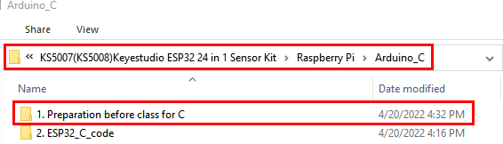

## 1. Description

The Keyestudio ESP32 24 in 1 sensor kit mainly contains 24 commonly used
sensors/modules, a ESP32 board, a ESP32 expansion board and Dupont
wires.

The 24 sensors and modules are fully compatible with the ESP32 Expansion
Board. You only need to stack the ESP32 mainboard onto the ESP32
Expansion Board, and hook up them with Dupont wires, which is simple and
convenient.

To make you master the electronic knowledge, detailed tutorials (Arduino
C), schematic diagrams, wiring methods and test code are included.
Through these projects, you will have a better understanding about
programming, logic and electronics.

## 2. Kit

(Note: KS5007 kit include ESP32 mainboard；KS5008 kit does‘t

include the ESP32 mainboard. )

<table>
<tbody>
<tr class="odd">
<td>#</td>
<td>Picture</td>
<td>Name</td>
<td>QTY</td>
</tr>
<tr class="even">
<td><ol type="1">
<li></li>
</ol></td>
<td></td>
<td>Keyestudio Purple LED Module</td>
<td>1</td>
</tr>
<tr class="odd">
<td><ol start="2" type="1">
<li></li>
</ol></td>
<td></td>
<td>Keyestudio Common Cathode RGB Module</td>
<td>1</td>
</tr>
<tr class="even">
<td><ol start="3" type="1">
<li></li>
</ol></td>
<td></td>
<td>Keyestudio Traffic Lights Module</td>
<td>1</td>
</tr>
<tr class="odd">
<td><ol start="4" type="1">
<li></li>
</ol></td>
<td></td>
<td>Keyestudio Active Buzzer</td>
<td>1</td>
</tr>
<tr class="even">
<td><ol start="5" type="1">
<li></li>
</ol></td>
<td></td>
<td>Keyestudio 8002b Audio Power Amplifier</td>
<td>1</td>
</tr>
<tr class="odd">
<td><ol start="6" type="1">
<li></li>
</ol></td>
<td></td>
<td>Keyestudio Button Module</td>
<td>1</td>
</tr>
<tr class="even">
<td><ol start="7" type="1">
<li></li>
</ol></td>
<td></td>
<td>Keyestudio Tilt Sensor</td>
<td>1</td>
</tr>
<tr class="odd">
<td><ol start="8" type="1">
<li></li>
</ol></td>
<td></td>
<td>Keyestudio PIR Motion Sensor</td>
<td>1</td>
</tr>
<tr class="even">
<td><ol start="9" type="1">
<li></li>
</ol></td>
<td></td>
<td>Keyestudio Obstacle Avoidance Sensor</td>
<td>1</td>
</tr>
<tr class="odd">
<td><ol start="10" type="1">
<li></li>
</ol></td>
<td></td>
<td>Keyestudio 6812 RGB Module</td>
<td>1</td>
</tr>
<tr class="even">
<td><ol start="11" type="1">
<li></li>
</ol></td>
<td></td>
<td>Keyestudio NTC-MF52AT Thermistor</td>
<td>1</td>
</tr>
<tr class="odd">
<td><ol start="12" type="1">
<li></li>
</ol></td>
<td></td>
<td>Keyestudio Photoresistor</td>
<td>1</td>
</tr>
<tr class="even">
<td><ol start="13" type="1">
<li></li>
</ol></td>
<td></td>
<td>Keyestudio Sound Sensor</td>
<td>1</td>
</tr>
<tr class="odd">
<td><ol start="14" type="1">
<li></li>
</ol></td>
<td></td>
<td>
Keyestudio

Rotary Potentiometer
</td>
<td>1</td>
</tr>
<tr class="even">
<td><ol start="15" type="1">
<li></li>
</ol></td>
<td></td>
<td>Keyestudio IR Receiver</td>
<td>1</td>
</tr>
<tr class="odd">
<td><ol start="16" type="1">
<li></li>
</ol></td>
<td></td>
<td>Keyestudio Reed Switch Sensor</td>
<td>1</td>
</tr>
<tr class="even">
<td><ol start="17" type="1">
<li></li>
</ol></td>
<td></td>
<td>Keyestudio Rotary Encoder Module</td>
<td>1</td>
</tr>
<tr class="odd">
<td><ol start="18" type="1">
<li></li>
</ol></td>
<td></td>
<td>Keyestudio Joystick Module</td>
<td>1</td>
</tr>
<tr class="even">
<td><ol start="19" type="1">
<li></li>
</ol></td>
<td></td>
<td>Keyestudio HT16K33 8X8 Dot Matrix Module</td>
<td>1</td>
</tr>
<tr class="odd">
<td><ol start="20" type="1">
<li></li>
</ol></td>
<td></td>
<td>Keyestudio TM1650 4-Digit Tube Display</td>
<td>1</td>
</tr>
<tr class="even">
<td><ol start="21" type="1">
<li></li>
</ol></td>
<td></td>
<td>Keyestudio Thin-film Pressure Sensor</td>
<td>1</td>
</tr>
<tr class="odd">
<td><ol start="22" type="1">
<li></li>
</ol></td>
<td></td>
<td>Keyestudio DS1307 Clock Sensor</td>
<td>1</td>
</tr>
<tr class="even">
<td><ol start="23" type="1">
<li></li>
</ol></td>
<td></td>
<td>Keyestudio SR01 Ultrasonic Sensor</td>
<td>1</td>
</tr>
<tr class="odd">
<td><ol start="24" type="1">
<li></li>
</ol></td>
<td></td>
<td>Servo</td>
<td>1</td>
</tr>
<tr class="even">
<td><ol start="25" type="1">
<li></li>
</ol></td>
<td></td>
<td>Keyestudio ESP32 Development Board</td>
<td>1</td>
</tr>
<tr class="odd">
<td><ol start="26" type="1">
<li></li>
</ol></td>
<td></td>
<td>Keyestudio ESP32-IO Expansion Board</td>
<td>1</td>
</tr>
<tr class="even">
<td><ol start="27" type="1">
<li></li>
</ol></td>
<td></td>
<td>Keyestudio IR Remote Control</td>
<td>1</td>
</tr>
<tr class="odd">
<td><ol start="28" type="1">
<li></li>
</ol></td>
<td></td>
<td>USB Cable</td>
<td>1</td>
</tr>
<tr class="even">
<td><ol start="29" type="1">
<li></li>
</ol></td>
<td></td>
<td>F-F Dupont Wire</td>
<td>1</td>
</tr>
</tbody>
</table>

## 3. Arduino C library and set up the ESP32 environment:

The Arduino C library needs to add in this tutorial is saved in the file
“Arduino Libraries”. At the same time, the Arduino IDE installation,
**Arduino C library** installation and set up the ESP32 environment

please refer to the file “Preparation before class for C(Raspberry Pi)”.

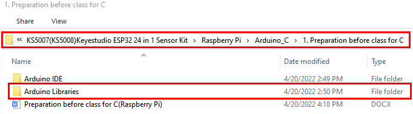

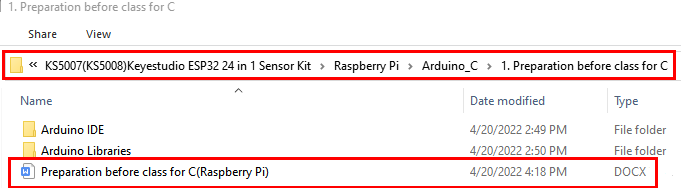

## 4.Single Sensor/Experiment Projects：

When we get the kit, we can see that there are 24 sensors/modules in the
kit, which contain the corresponding ESP32 mainboard, ESP32 Expansion
Board and wirings. Here, we will connect the 24 sensors individually to
the ESP32 mainboard and the ESP32 Expansion Board using the wirings.
Then run the corresponding code to test the function of each sensor
separately. Our next projects are work to study the principles of
individual modules/sensors from simple to complex as well as some
extended applications of sensors to consolidate and deepen our
understanding of the kits.

Note : When connecting the module/sensor wirings in the projects, the
wiring method and position must be followed in the document. What’s
more, do not misconnect the power supply and signal pins, otherwise
there may be no experimental results or damage to the modules/sensors.  

### Project 1: Hello World

1.  **Overview**

For ESP32 beginners, we will start with some simple things. In this
project, you only need a ESP32 mainboard, a USB cable and Raspberry Pi
to complete the "Hello World\!" project, which is a test of
communication between the ESP32 mainboard and the Raspberry Pi as well
as a primary project.

2.  **Components**

<table>
<tbody>
<tr class="odd">
<td></td>
<td></td>
</tr>
<tr class="even">
<td>ESP32*1</td>
<td>USB Cable*1</td>
</tr>
</tbody>
</table>

3.  **Wiring Diagram：**

In this project, we will use a USB cable to connect the ESP32 to
Raspberry Pi.

**4. Test Code**

<table>
<tbody>
<tr class="odd">
<td>
//*************************************************************************************

/*

* Filename : Hello World

* Description : Enter the letter R,and the serial port displays"Hello World".

* Auther :http//www.keyestudio.com

*/

char val;// defines variable "val"

void setup()

void loop()

}

}

//*************************************************************************************
</td>
</tr>
</tbody>
</table>

Before uploading the test code to the
ESP32，click“Tools”→“Board”，select“ESP32 Wrover Module”.

Select the correct serial port

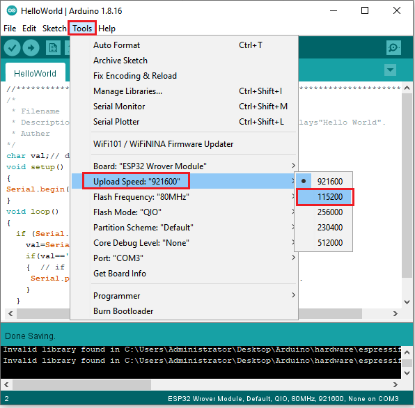

Click  to upload the test code to the ESP32.

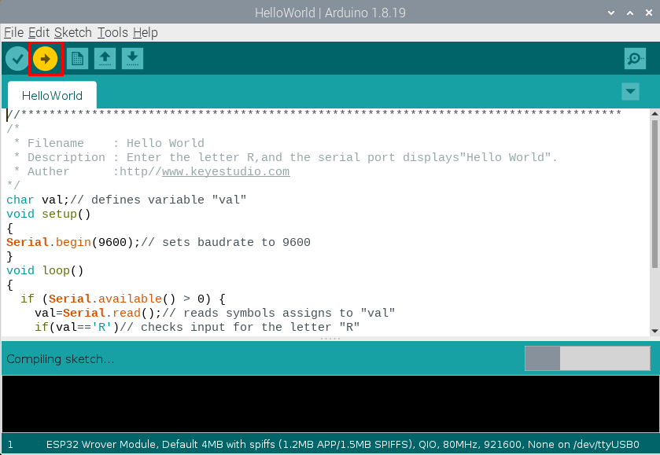

Note: If the uploading code fails, you can press and hold the Boot
button on the ESP32 after clickingand release it
after the percentage of uploading progress

appears., as shown below:  

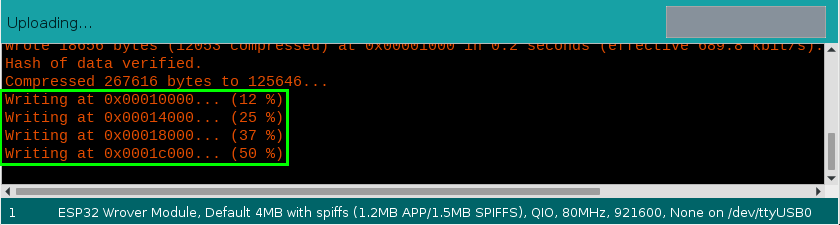

The code is uploaded successfully

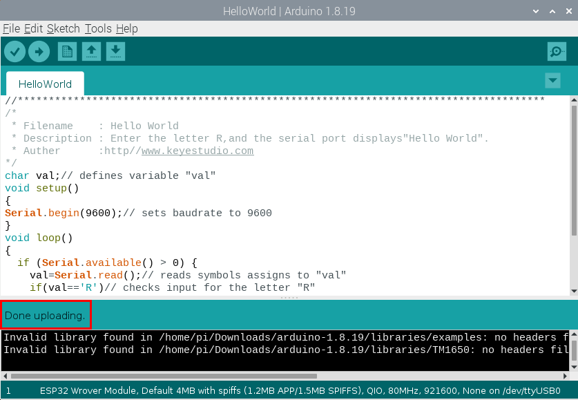

**5. Test Result**

After uploading successfully，we will use a USB cable to power
on，click, set the baud rate to 9600, then press
the reset button on the ESP32 motherboard and enter the
letter“R”，click“Send”, then the serial monitor prints“Hello
World\!”.

### Project 2: Lighting up LED

1.  **Overview**

In this kit, we have a Keyestudio Purple Module, which is very simple to
control. If you want to light up the LED, you just need to make a
certain voltage across it.

In the project, we will control the high and low level of the signal end
S through programming, so as to control the LED on and off. 

2.  **Working Principle**

The two circuit diagrams are given.

The left one is wrong wiring-up diagram. Why? Theoretically, when the S
terminal outputs high levels, the LED will receive the voltage and light
up.

Due to limitation of IO ports of ESP32 board, weak current can’t make
LED brighten.

The right one is correct wiring-up diagram. GND and VCC are powered up.
When the S terminal is a high level, the triode Q1 will be connected and
LED will light up(note: current passes through LED and R3 to reach GND
by VCC not IO ports). Conversely, when the S terminal is a low level,
the triode Q1 will be disconnected and LED will go off.

3.  **Components**

<table>
<tbody>
<tr class="odd">
<td></td>
<td></td>
<td></td>
<td></td>
<td></td>
</tr>
<tr class="even">
<td>ESP32 Board*1</td>
<td>ESP32 Expansion Board*1</td>
<td>Keyestudio Purple LED Module*1</td>
<td>3P Dupont Wire*1</td>
<td>
Micro

USB Cable*1
</td>
</tr>
</tbody>
</table>

4.  **Wiring Diagram**

5.  **Test Code**

<table>
<tbody>
<tr class="odd">
<td>
//*************************************************************************************

/*

* Filename : Blink

* Description : led Flashing 1 s

* Auther : http://www.keyestudio.com

*/

int ledPin = 0; //Define LED pin connection to GPIO0

void setup() 

void loop() 

//*************************************************************************************
</td>
</tr>
</tbody>
</table>

6.  **Code Explanation**

1\. PinMode(pin,mode): Pin is the ESP32 GPIO pin number used to set the
mode, here we set pin 0 as output mode.

2\. DigitalWrite(pin, value): Pin is the GPIO pin, which is defined GP0
here. Valueis the digital level that we will output（HIGH/LOW）. If the
pin is configured to OUTPUT using pinMode(), its voltage is set to the
corresponding value: 3.3V is HIGH,low level is 0V (ground). When connect
the LEDs to the pins, using the digitalWrite（HIGH）, the LEDs will get
dim.

3\. Setup() executes once, while loop() executes all the time. Delay
(ms) is delay function, ms is the number of milliseconds to pause. Data
type: unsigned long（range 0\~ 4,294,967,295 (2^32 - 1)）.

Firstly, we connect the module signal to ledPIN, namely GP0, and set it
to a high level to light the LEDs on the module. Then delay 1000 ms,
controlling the LEDs on the module light up for 1s and off for 1s to
achieve the flashing effect. 

7.  **Test Result**

Connect the wires according to the experimental wiring diagram, compile
and upload the code to the ESP32. After uploading successfully，we will
use a USB cable to power on，we will see that the LED in the circuit will
flash alternately.

### Project 3: Traffic Lights Module

1.  **Overview**

In this lesson, we will learn how to control multiple LED lights and
simulate the operation of traffic lights.

Traffic lights are signal devices positioned at road intersections,
pedestrian crossings, and other locations to control flows of traffic.

In this kit, we will use the traffic light module to simulate the
traffic light.

2.  **Working Principle**

In previous lesson, we already know how to control an LED. In this part,
we only need to control three separated LEDs. Output high levels to the
signal R(3.3V), then the red LED will be on.

3.  **Components**

<table>
<tbody>
<tr class="odd">
<td></td>
<td></td>
<td></td>
<td></td>
<td></td>
</tr>
<tr class="even">
<td>ESP32 Board*1</td>
<td>ESP32 Expansion Board*1</td>
<td>Keyestudio DIY Traffic Lights Module*1</td>
<td>5P Dupont Wire*1</td>
<td>Micro USB Cable*1</td>
</tr>
</tbody>
</table>

4.  **Wiring Diagram**
    
    

5.  **Test Code**

<table>
<tbody>
<tr class="odd">
<td>
//*************************************************************************************

/*

* Filename : Traffic_Light

* Description : Simulated traffic lights

* Auther : http://www.keyestudio.com

*/

int redPin = 15; //Red LED connected to GPIO15

int yellowPin = 2; //Yellow LED connected to GPIO2

int greenPin = 0; //Green LED connected to GPIO0

void setup() 

void loop() 

digitalWrite(redPin, HIGH); //Lighting red LED

delay(5000); //Delay5s

digitalWrite(redPin, LOW); //Turn off red LED

}

//*************************************************************************************
</td>
</tr>
</tbody>
</table>

6.  **Code Explanation**

Create pins, set pins mode and delayed functions.

We use the function for(). for (int i = 1; i \<= 3; i = i + 1)
represents the variable i adds 1 fir each time from 1 to 3.

The function for (int i = 255; i \>= 0; i = i - 1) indicates that i
reduces by 1 each time. When i\<0, exit the for() loop and execute 256
times

7.  **Test Result**

Connect the wires according to the experimental wiring diagram, compile
and upload the code to the ESP32. After uploading successfully，we will
use a USB cable to power on，then the green LED will be on for 5s then
off, the yellow LED will flash for 3s then go off and the red one will
be on for 5s then off, the three LED modules will simulate the
circulation of traffic lights automatically .

### Project 4: Breathing LED

1.  **Overview**

A“breathing LED”is a phenomenon where an LED's brightness smoothly
changes from dark to bright and back to dark, continuing to do so and
giving the illusion of an LED“breathing. This phenomenon is similar to a
lung breathing in and out. So how to control LED’s brightness? We need
to take advantage of PWM.

2.  **Components**

<table>
<tbody>
<tr class="odd">
<td></td>
<td></td>
<td></td>
<td></td>
<td></td>
</tr>
<tr class="even">
<td>ESP32 Board*1</td>
<td>ESP32 Expansion Board*1</td>
<td>Keyestudio Purple LED Module*1</td>
<td>3P Dupont Wire*1</td>
<td>MicroUSB Cable*1</td>
</tr>
</tbody>
</table>

3.  **Connection Diagram**

4.  **Test Code**

<table>
<tbody>
<tr class="odd">
<td>
//**********************************************************************

/*

* Filename : Breathing Led

* Description : Make led light fade in and out, just like breathing.

* Auther : http//www.keyestudio.com

*/

#define PIN_LED 0 //define the led pin

#define CHN 0 //define the pwm channel

#define FRQ 1000 //define the pwm frequency

#define PWM_BIT 8 //define the pwm precision

void setup() 

void loop() 

for (int i = 255; i &gt; -1; i--) 

}

//*************************************************************************************
</td>
</tr>
</tbody>
</table>

**5.Test Result**

Connect the wires according to the experimental wiring diagram, compile
and upload the code to the ESP32. After uploading successfully，we will
use a USB cable to power on，then the LED on the module gradually gets
dimmer then brighter, cyclically, like human breathe.

### Project 5: RGB Module

1.  **Overview**
    
    

Among these modules is a RGB module. It adopts a F10-full color RGB
foggy common cathode LED. We connect the RGB module to the PWM port of
MCU and the other pin to GND(for common anode RGB, the rest pin will be
connected to VCC). So what is PWM?

PWM is a means of controlling the analog output via digital means.
Digital control is used to generate square waves with different duty
cycles (a signal that constantly switches between high and low levels)
to control the analog output.In general, the input voltages of ports are
0V and 5V. What if the 3V is required? Or a switch among 1V, 3V and
3.5V? We cannot change resistors constantly. For this reason, we resort
to PWM.

For Arduino digital port voltage outputs, there are only LOW and HIGH
levels, which correspond to the voltage outputs of 0V and 5V
respectively. You can define LOW as“0”and HIGH as“1’, and let the
Arduino output five hundred‘0’or“1”within 1 second. If output five
hundred‘1’, that is 5V; if all of which is‘0’,that is 0V; if output 250
01 pattern, that is 2.5V.

This process can be likened to showing a movie. The movie we watch are
not completely continuous. Actually, it generates 25 pictures per
second, which cannot be told by human eyes. Therefore, we mistake it as
a continuous process. PWM works in the same way. To output different
voltages, we need to control the ratio of 0 and 1. The more‘0’or‘1’
output per unit time, the more accurate the control.

2.  **Working Principle**

For our experiment, we will control the RGB module to display different
colors through three PWM values.

3.  **Components**

<table>
<tbody>
<tr class="odd">
<td></td>
<td></td>
<td></td>
<td></td>
<td></td>
</tr>
<tr class="even">
<td>ESP32 Board*1</td>
<td>ESP32 Expansion Board*1</td>
<td>Keyestudio Common Cathode RGB Module *1</td>
<td>4P Dupont Wire*1</td>
<td>Micro USB Cable*1</td>
</tr>
</tbody>
</table>

4.  **Connection Diagram**
    
    

5.  **Test Code**

<table>
<tbody>
<tr class="odd">
<td>
//**********************************************************************

/*

* Filename : RGB LED

* Description : Use RGBLED to show random color.

* Auther : http//www.keyestudio.com

*/

int ledPins[] = ; //define red, green, blue led pins

const byte chns[] = ; //define the pwm channels

int red, green, blue;

void setup() 

}

void loop() 

void setColor(byte r, byte g, byte b) 

//*************************************************************************************
</td>
</tr>
</tbody>
</table>

6.  **Test Result**

Connect the wires according to the experimental wiring diagram, compile
and upload the code to the ESP32. After uploading successfully，we will
use a USB cable to power on，we will see that the RGB LED on the module
starts to display random colors.

### Project 6: Button Sensor

1.  **Overview**

In this kit, there is a Keyestudio single-channel button module, which
mainly uses a tact switch and comes with a yellow button cap.

In previous lessons, we learned how to make the pins of our single-chip
microcomputer output a high level or low level. In this experiment, we
will read the high level (3.3V) and low level (0V).

We can determine whether the button on the sensor is pressed by reading
the high and low level of the S terminal on the sensor.

2.  **Working Principle**

The button module has four pins. The pin 1 is connected to the pin 3 and
the pin 2 is linked with the pin 4. When the button is not pressed, they
are disconnected. Yet, when the button is pressed, they are connected.
If the button is released, the signal end is high level.

3.  **Components**

<table>
<tbody>
<tr class="odd">
<td></td>
<td></td>
<td></td>
<td></td>
<td></td>
</tr>
<tr class="even">
<td>ESP32 Board*1</td>
<td>ESP32 Expansion Board*1</td>
<td>Keyestudio DIY Button Module*1</td>
<td>3P Dupont Wire*1</td>
<td>Micro USB Cable*1</td>
</tr>
</tbody>
</table>

4.  **Connection Diagram**

5.  **Test Code**

<table>
<tbody>
<tr class="odd">
<td>
//*************************************************************************************

/*

* Filename : button

* Description : Read key value

* Auther : http://www.keyestudio.com

*/

int val = 0; //Useto store key values

int button = 15; //The pin of the button is connected to GP15

void setup() 

void loop() 

else 

}

//*************************************************************************************
</td>
</tr>
</tbody>
</table>

6.  **Code Explanation**

**1. pinMode(button, INPUT)**; set the pin of the button module to GP15
and INPUT.

Configure INPUT through pinMode(). INPUT must use the pull-up or
pull-down resistor(ours module has the pull-up resistor R1).

**2. Serial.begin(9600)**: Initialize serial communication and set the
baud rate to 9600.

**3. digitalRead(button)**: read the digital level of the button(HIGH or
LOW). If this pin is not connected to pins, the digitalRead() will
return HIGH or LOW.

**4. if..else..**：if the logic behind () is true, execute the code of
(); otherwise execute the code of **else**.

5\. If the button is pressed, the signal end is low level, GP15 is low
level and Val is 0. Then the monitor will show the corresponding value
and characters; otherwise, the sensor is released, val is 1 and monitor
will show 1 and other characters

**7. Test Result**

Connect the wires according to the experimental wiring diagram, compile
and upload the code to the ESP32. After uploading successfully，we will
use a USB cable to power on，open the serial monitor and set the baud
rate to 9600. We need to press the reset button on the ESP32, then the
serial monitor will display the corresponding data and characters. When
the button is pressed, val is 0, the monitor will show“Press the
button”；when the button is released, val is 1，the monitor will
show“Loosen the button”; as shown below

### Project 7: Obstacle Avoidance Sensor

1.  **Overview**

In this kit, there is a Keyestudio obstacle avoidance sensor, which
mainly uses an infrared emitting and a receiving tube. In the
experiment, we will determine whether there is an obstacle by reading
the high and low level of the S terminal on the sensor.

**2. Working Principle**

NE555 circuit provides IR signals with frequency to the emitter TX, then
the IR signals will fade with the increase of transmission distance. If
encountering the obstacle, it will be reflected back.

When the receiver RX meets the weak signals reflected back, the
receiving pin will output high levels, which indicates the obstacle is
far away. On the contrary, it the reflected signals are stronger, low
levels will be output, which represents the obstacle is close. There are
two potentiometers on the module, and one is for adjusting emission
power, another one is for receiving frequency.

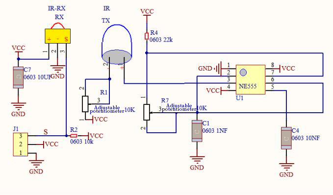

**3. Components**

<table>
<tbody>
<tr class="odd">
<td></td>
<td></td>
<td></td>
<td></td>
<td></td>
</tr>
<tr class="even">
<td>ESP32 Board*1</td>
<td>ESP32 Expansion Board*1</td>
<td>Keyestudio DIY Obstacle Avoidance Sensor*1</td>
<td>3P Dupont Wire*1</td>
<td>Micro USB Cable*1</td>
</tr>
</tbody>
</table>

**4. Connection Diagram**

**5. Test Code**

<table>
<tbody>
<tr class="odd">
<td>
//*************************************************************************************

/*

* Filename : obstacle avoidance sensor

* Description : Reading the obstacle avoidance value

* Auther : http://www.keyestudio.com

*/

int val = 0;

void setup() 

void loop() 

else 

}

//*************************************************************************************
</td>
</tr>
</tbody>
</table>

**6. Code Explanation**

**Note:**

Upload the test code and wire up according to the connection diagram.
After powering on, we start to adjust the two potentiometers to sense
distance.

1.  Adjust the potentiometer transmitting power. Make the P LED at the
    critical point of ON and OFF states.

2\. Adjust the potentiometer receiving frequency. Rotate it clockwisely,
the frequency will increase. Make the S LED at the critical point of ON
and OFF states, then the 38KHz square wave can be produced.

**7. Test Result**

Connect the wires according to the experimental wiring diagram, compile
and upload the code to the ESP32. After uploading successfully，we will
use a USB cable to power on，open the serial monitor and set the baud
rate to 9600. We need to press the reset button on the ESP32, then the
serial monitor will display the corresponding data and characters. When
the sensor detects the obstacle, the val is 0,the monitor will
show“There are obstacles”; if the obstacle is not detected, the val is
1,“All going well” will be shown.

### Project 8: Tilt Module

**1. Overview**

In this kit, there is a Keyestudio tilt sensor. The tilt switch can
output signals of different levels according to whether the module is
tilted. There is a ball inside. When the switch is higher than the
horizontal level, the switch is turned on, and when it is lower than the
horizontal level, the switch is turned off. This tilt module can be used
for tilt detection, alarm or other detection.

**2. Working Principle**

The working principle is pretty simple. When pin 1 and 2 of the ball
switch P1 are connected, the signal S is low level and the red LED will
light up; when they are disconnected, the pin will be pulled up by the
4.7K R1 and make S a high level, then LED will be off.

**3. Components**

<table>
<tbody>
<tr class="odd">
<td></td>
<td></td>
<td></td>
<td></td>
<td></td>
</tr>
<tr class="even">
<td>ESP32 Board*1</td>
<td>ESP32 Expansion Board*1</td>
<td>
Keyestudio

Tilt Sensor*1
</td>
<td>3P Dupont Wire*1</td>
<td>Micro USB Cable*1</td>
</tr>
</tbody>
</table>

**4. Connection Diagram**

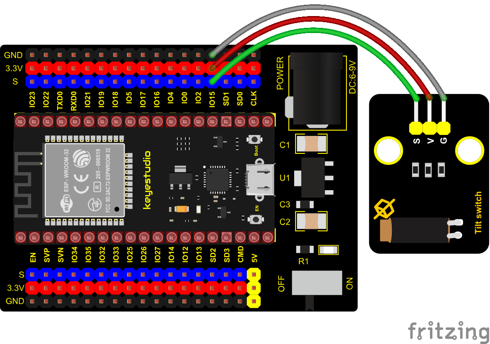

**5. Test Code**

<table>
<tbody>
<tr class="odd">
<td>
//*************************************************************************************

/*

* Filename : Tilt switch

* Description : Reading the tilt sensor value

* Auther :http://www.keyestudio.com

*/

int val; //Store the level value output by the tilt sensor

void setup() 

void loop() 

//*************************************************************************************
</td>
</tr>
</tbody>
</table>

**7. Test Result**

Connect the wires according to the experimental wiring diagram, compile
and upload the code to the ESP32. After uploading successfully，we will
use a USB cable to power on，open the serial monitor and set the baud
rate to 9600 and press the reset button on the ESP32. Make the tilt
module incline to one side, the red LED on the module will be off and
the monitor will display“1”. In contrast, if you make it incline the
other side, the red LED will light up and the monitor will display“0”.

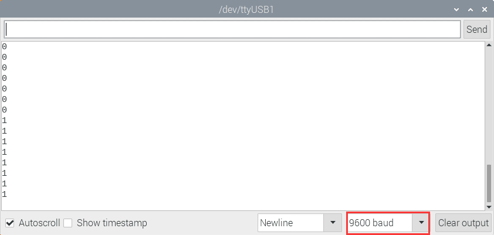

### Project 9: Reed Switch Module

**1. Overview**

In this kit, there is a Keyestudio reed switch module, which mainly uses
a MKA10110 green reed component.

The reed switch is the abbreviation of the dry reed switch. It is a
passive electronic switch element with contacts.

It has the advantages of simple structure, small size and easy control.

Its shell is a sealed glass tube with two iron elastic reed electric
plates.

In the experiment, we will determine whether there is a magnetic field
near the module by reading the high and low level of the S terminal on
the module; and, we display the test result in the shell.

**2. Working Principle**

In normal conditions, the glass tube in the two reeds made of special
materials are separated. When a magnetic substance close to the glass
tube, in the role of the magnetic field lines, the pipe within the two
reeds are magnetized to attract each other in contact, the reed will
suck together, so that the junction point of the connected circuit
communication.

After the disappearance of the outer magnetic reed because of their
flexibility and separate, the line is disconnected. The sensor uses this
characteristic to build a circuit to convert magnetic field signal into
high and low level signal.  

**3. Components**

<table>
<tbody>
<tr class="odd">
<td></td>
<td></td>
<td></td>
<td></td>
<td></td>
</tr>
<tr class="even">
<td>ESP32 Board*1</td>
<td>ESP32 Expansion Board*1</td>
<td>Keyestudio DIY Reed Switch Module*1</td>
<td>3P Dupont Wire*1</td>
<td>Micro USB Cable*1</td>
</tr>
</tbody>
</table>

**4. Connection Diagram**

**5. Test Code**

<table>
<tbody>
<tr class="odd">
<td>
//*************************************************************************************

/*

* Filename : Reed Switch

* Description : Read the value of the reed sensor

* Auther : http://www.keyestudio.com

*/

int val = 0;

int reedPin = 15; //Define dry reed module signal pin connected to GPIO15

void setup() 

void loop() 

else 

}

//*************************************************************************************
</td>
</tr>
</tbody>
</table>

**6. Test Result**

Connect the wires according to the experimental wiring diagram, compile
and upload the code to the ESP32. After uploading successfully，we will
use a USB cable to power on，open the serial monitor and set the baud
rate to 9600. We need to press the reset button on the ESP32, then the
serial monitor will display the corresponding data and characters.

When the sensor detects a magnetic field, val is 0 and the red LED of
the module lights up, "0 A magnetic field" will be displayed; when no
magnetic field is detected, val is 1, and the LED on the module goes
out, "1 There is no magnetic field" will be shown, as shown below.

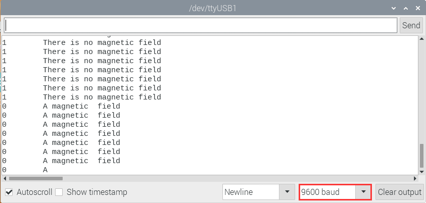

### Project 10: PIR Motion Sensor

**1. Overview**

In this kit, there is a Keyestudio PIR motion sensor, which mainly uses
an RE200B-P sensor elements. It is a human body pyroelectric motion
sensor based on pyroelectric effect, which can detect infrared rays
emitted by humans or animals, and the Fresnel lens can make the sensor's
detection range farther and wider.

In the experiment, we determine if there is someone moving nearby by
reading the high and low levels of the S terminal on the module. The
detected results will be displayed on the Shell.

**2. Working Principle**

The upper left part is voltage conversion(VCC to 3.3V). The working
voltage of sensors we use is 3.3V, therefore we can’t use 5V directly.
The voltage conversion circuit is needed.

When no person is detected or no infrared signal is received, and pin 1
of the sensor outputs low level. At this time, the LED on the module
will light up and the MOS tube Q1 will be connected and the signal
terminal S will detect Low levels.

When one is detected or an infrared signal is received, and pin 1 of the
sensor outputs a high level. Then LED on the module will go off, the MOS
tube Q1 is disconnected and the signal terminal S will detect high
levels.

**3. Required Components**

<table>
<tbody>
<tr class="odd">
<td></td>
<td></td>
<td></td>
<td></td>
<td></td>
</tr>
<tr class="even">
<td>ESP32 Board*1</td>
<td>ESP32 Expansion Board*1</td>
<td>Keyestudio DIY PIR Motion Sensor*1</td>
<td>3P Dupont Wire*1</td>
<td>Micro USB Cable*1</td>
</tr>
</tbody>
</table>

**4. Connection Diagram**

**5. Test Code**

<table>
<tbody>
<tr class="odd">
<td>
//*************************************************************************************

/*

* Filename : PIR motion

* Description : Reading the value of the human body infrared sensor

* Auther : http://www.keyestudio.com

*/

int val = 0;

int pirPin = 15; //The pin of PIR motion sensor is defined as GPIO15

void setup() 

void loop() 

else 

}

//*************************************************************************************
</td>
</tr>
</tbody>
</table>

**6. Test Result**

Connect the wires according to the experimental wiring diagram, compile
and upload the code to the ESP32. After uploading successfully，we will
use a USB cable to power on，open the serial monitor and set the baud
rate to 9600 and press the reset button on the ESP32. The serial monitor
will display the corresponding data and characters.

When the sensor detects someone nearby, value is 1, the LED will go off
and the monitor will show“1 Somebody is in this area\!”. In contrast,
the value is 0, the LED will go up and“0 No one\!”will be shown.

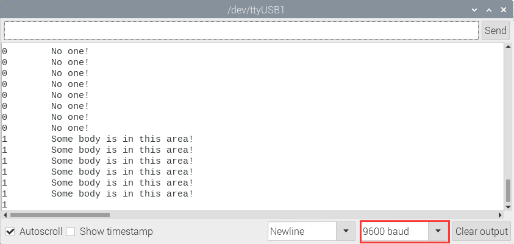

### Project 11: Active Buzzer

**1. Overview**

In this kit, it contains an active buzzer module and a power amplifier
module (the principle is equivalent to a passive buzzer). In this
experiment, we control the active buzzer to emit sounds. Since it has
its own oscillating circuit, the buzzer will automatically sound if
given large voltage.

**2. Working Principle**

From the schematic diagram, the pin of buzzer is connected to a resistor
R2 and another port is linked with a NPN triode Q1. So, if this triode
Q1 is powered, the buzzer will sound.

If the base electrode of the triode connected to the R1 resistor is a
high level, the triode Q1 will be connected.If the base electrode is
pulled down by the resistor R3, the triode is disconnected.

When we output a high level from the IO port to the triode, the buzzer
will emit sounds; if outputting low levels, the buzzer won’t emit
sounds.

**3. Components**

<table>
<tbody>
<tr class="odd">
<td></td>
<td></td>
<td></td>
<td></td>
<td></td>
</tr>
<tr class="even">
<td>ESP32 Board*1</td>
<td>ESP32 Expansion Board*1</td>
<td>Keyestudio Active Buzzer*1</td>
<td>3P Dupont Wire*1</td>
<td>Micro USB Cable*1</td>
</tr>
</tbody>
</table>

**4. Connection Diagram**

**5. Test Code**

<table>
<tbody>
<tr class="odd">
<td>
//*************************************************************************************

/*

* Filename : Active buzzer

* Description : An active buzzer produces sound

* Auther : http://www.keyestudio.com

*/

int buzzer = 15; //Define buzzer receiver pin GPIO15

void setup() 

void loop() 

//*************************************************************************************
</td>
</tr>
</tbody>
</table>

**6. Code Explanation**

In the experiment, we set the pin to GPIO15. When setting to high, the
active buzzer will beep; when setting to low, the active buzzer will
stop emitting sounds.

**7. Test Result**

Connect the wires according to the experimental wiring diagram, compile
and upload the code to the ESP32. After uploading successfully，we will
use a USB cable to power on. The active buzzer will emit sound for 1
second, and stop for 1 second.

### Project 12: 8002b Audio Power Amplifier

**1. Overview**

In this kit, there is a Keyestudio 8002b power amplifier. The main
components of this module are an adjustable potentiometer, a speaker,
and an audio amplifier chip;

The main function of this module is: it can amplify the output audio
signal, with a magnification of 8.5 times, and play sound or music
through the built-in low-power speaker, as an external amplifying device
for some music playing equipment.

In the experiment, we used the 8002b power amplifier speaker module to
emit sounds of various frequencies.

**2. Working Principle**

In fact, it is similar to a passive buzzer. The active buzzer has its
own oscillation source. Yet, the passive buzzer does not have internal
oscillation. When controlling the circuit, we need to input square waves
of different frequencies to the positive pole of the component and
ground the negative pole to control the buzzer to chime sounds of
different frequencies.

**3. Components**

<table>
<tbody>
<tr class="odd">
<td></td>
<td></td>
<td></td>
<td></td>
<td></td>
</tr>
<tr class="even">
<td>ESP32 Board*1</td>
<td>ESP32 Expansion Board*1</td>
<td>Keyestudio 8002b Audio Power Amplifier*1</td>
<td>3P Dupont Wire*1</td>
<td>Micro USB Cable*1</td>
</tr>
</tbody>
</table>

**4. Connection Diagram**

**5. Test Code**

<table>
<tbody>
<tr class="odd">
<td>
//**********************************************************************

/*

* Filename : Passive Buzzer

* Description : Passive Buzzer sounds the alarm.

* Auther : http//www.keyestudio.com

*/

#define LEDC_CHANNEL_0 0

// LEDC timer uses 13 bit accuracy

#define LEDC_TIMER_13_BIT 13

// Define tool I/O ports

#define BUZZER_PIN 15

//Create a musical melody list, Super Mario

int melody[] = ;

//Create a list of tone durations

int noteDurations[] = ;

void setup() 

void loop() 

}

//**********************************************************************
</td>
</tr>
</tbody>
</table>

**6. Test Result**

Connect the wires according to the experimental wiring diagram, compile
and upload the code to the ESP32. After uploading successfully，we will
use a USB cable to power on，then the power amplifier module will emit
the sound on a loop.

### Project 13: Potentiometer

1.  **Overview**

The following we will introduce is the Keyestudio rotary potentiometer
which is an analog sensor.

The digital IO ports can read the voltage value between 0 and 3.3V and
the module only outputs high levels. However, the analog sensor can read
the voltage value through 16 ADC analog ports on the ESP32 board. In the
experiment, we will display the test results on the Shell.

**2. Working Principle**

It uses a 10K adjustable resistor. We can change the resistance by
rotating the potentiometer. The signal S can detect the voltage
changes(0-3.3V) which are analog quantity.

**ADC：**The more bits an ADC has, the denser the partitioning of the
simulation, the higher the accuracy of the final conversion.

The conversion formula is as follows:

**DAC：**The higher the precision of DAC, the higher the precision of the
output voltage value.  

The conversion formula is as follows:  

**ADC on ESP32：**

The ESP32 has 16 pins that can be used to measure analog signals. GPIO
pin serial numbers and analog pin definitions are shown below:  

<table>
<tbody>
<tr class="odd">
<td>ADC number in ESP32</td>
<td>ESP32 GPIO number</td>
</tr>
<tr class="even">
<td>ADC0</td>
<td>GPIO 36</td>
</tr>
<tr class="odd">
<td>ADC3</td>
<td>GPIO 39</td>
</tr>
<tr class="even">
<td>ADC4</td>
<td>GPIO 32</td>
</tr>
<tr class="odd">
<td>ADC5</td>
<td>GPIO33</td>
</tr>
<tr class="even">
<td>ADC6</td>
<td>GPIO34</td>
</tr>
<tr class="odd">
<td>ADC7</td>
<td>GPIO 35</td>
</tr>
<tr class="even">
<td>ADC10</td>
<td>GPIO 4</td>
</tr>
<tr class="odd">
<td>ADC11</td>
<td>GPIO0</td>
</tr>
<tr class="even">
<td>ADC12</td>
<td>GPIO2</td>
</tr>
<tr class="odd">
<td>ADC13</td>
<td>GPIO15</td>
</tr>
<tr class="even">
<td>ADC14</td>
<td>GPIO13</td>
</tr>
<tr class="odd">
<td>ADC15</td>
<td>GPIO 12</td>
</tr>
<tr class="even">
<td>ADC16</td>
<td>GPIO 14</td>
</tr>
<tr class="odd">
<td>ADC17</td>
<td>GPIO27</td>
</tr>
<tr class="even">
<td>ADC18</td>
<td>GPIO25</td>
</tr>
<tr class="odd">
<td>ADC19</td>
<td>GPIO26</td>
</tr>
</tbody>
</table>

**DAC on ESP32：**

The ESP32 has two 8-bit digital-to-analog converters connected to GPIO25
and GPIO26 pins, which are immutable, as shown below :

<table>
<tbody>
<tr class="odd">
<td>Simulate pin number</td>
<td>GPIO number</td>
</tr>
<tr class="even">
<td>DAC1</td>
<td>GPIO25</td>
</tr>
<tr class="odd">
<td>DAC2</td>
<td>GPIO26</td>
</tr>
</tbody>
</table>

**3. Components**

<table>
<tbody>
<tr class="odd">
<td></td>
<td></td>
<td></td>
<td></td>
<td></td>
</tr>
<tr class="even">
<td>ESP32 Board*1</td>
<td>ESP32 Expansion Board*1</td>
<td>Keyestudio Rotary Potentiometer*1</td>
<td>3P Dupont Wire*1</td>
<td>Micro USB Cable*1</td>
</tr>
</tbody>
</table>

**4. Connection Diagram**

**5. Test Code**

<table>
<tbody>
<tr class="odd">
<td>
//**********************************************************************************

/*

* Filename : Rotary_potentiometer

* Description : Read the basic usage of ADC，DAC and Voltage

* Auther : http//www.keyestudio.com

*/

#define PIN_ANALOG_IN 34 //the pin of the Potentiometer

void setup() 

//In loop()，the analogRead() function is used to obtain the ADC value,

//and then the map() function is used to convert the value into an 8-bit precision DAC value.

//The input and output voltage are calculated according to the previous formula,

//and the information is finally printed out.

void loop() 

//**********************************************************************************
</td>
</tr>
</tbody>
</table>

**6. Code Explanation**

1\. analogVal means analog value. The rotary potentiometer outputs
analog values(0\~4095), therefore, we set pins to analog ports. For
example, we connect to GPIO34.

2\. analogRead(pin): read the value of the specified analog pin. The
ESP32 contains a multi-channel, 12-bit converter. This means that it
will map the input voltage between 0 and the working voltage (5V or 3.3V
) to an integer value between 0 and 4095. For example, this will produce
a resolution among readings: 3.3V/4096 stands for 0.0008V per unit.

3\. The map() function converts this 12-bit DAC value to an 8-bit DAC
value.  

4\. Pin: the name of analog input pin.

5\. The serial monitor displays the values of adcVal, dacVal, voltage,
the baud rate must be set before display (we default to 9600, which can
be changed).  

**7. Test Result**

Connect the wires according to the experimental wiring diagram, compile
and upload the code to the ESP32. After uploading successfully，we will
use a USB cable to power on, open the serial monitor and set the baud
rate to 9600 and press the reset button on the ESP32. The serial monitor
will display the potentiometer's ADC value, DAC value and voltage value.
Rotate the potentiometer handle, the analog values will change.

### Project 14: Sound Sensor

1.  **Overview**

In this kit, there is a Keyestudio DIY electronic block and a sound
sensor. In the experiment, we test the analog value corresponding to the
sound level in the current environment with it. The louder the sound,
the larger the ADC, DAC and the voltage value, and the “shell” window
will display the test results.

**2. Working Principle**

It uses a high-sensitive microphone component and an LM386 chip. We
build the circuit with the LM386 chip and amplify the sound through the
high-sensitive microphone. In addition, we can adjust the sound volume
by the potentiometer. Rotate it clockwise, the sound will get louder.

**3. Components**

<table>
<tbody>
<tr class="odd">
<td></td>
<td></td>
<td></td>
<td></td>
<td></td>
</tr>
<tr class="even">
<td>ESP32 Board*1</td>
<td>ESP32 Expansion Board*1</td>
<td>Keyestudio DIY Sound Sensor*1</td>
<td>3P Dupont Wire*1</td>
<td>Micro USB Cable*1</td>
</tr>
</tbody>
</table>

**4. Connection Diagram**

**5. Test Code**

<table>
<tbody>
<tr class="odd">
<td>
//**********************************************************************************

/*

* Filename : MicroPhone

* Description : Read the basic usage of ADC，DAC and Voltage

* Auther : http//www.keyestudio.com

*/

#define PIN_ANALOG_IN 34 //the pin of the Sound Sensor

void setup() 

//In loop()，the analogRead() function is used to obtain the ADC value,

//and then the map() function is used to convert the value into an 8-bit precision DAC value.

//The input and output voltage are calculated according to the previous formula,

//and the information is finally printed out.

void loop() 

//**********************************************************************************
</td>
</tr>
</tbody>
</table>

**6. Test Result**

Connect the wires according to the experimental wiring diagram, compile
and upload the code to the ESP32. After uploading successfully，we will
use a USB cable to power on, open the serial monitor and set the baud
rate to 9600 and press the reset button on the ESP32.

The serial monitor will display the sound sensor’s ADC value, DAC value
and voltage value. Rotate the potentiometer clockwise and speak at the
MIC. Then you can see the analog value get larger, as shown below:

### Project 15: Photoresistor

1.  **Description**

In this kit, there is a photoresistor consists of photosensitive
resistance elements. Its resistance changes with the light intensity.
Also, it converts the resistance change into a voltage change through
the characteristic of the photosensitive resistive element. When wiring
it up, we interface its signal terminal (S terminal) with the analog
port of ESP32 , so as to sense the change of the analog value, and
display the corresponding analog value in the shell.

**2. Working Principle**

If there is no light, the resistance is 0.2MΩ and the detected voltage
at the terminal 2 is close to 0. When the light intensity increases, the
resistance of photoresistor and detected voltage will diminish.

**3. Components**

<table>
<tbody>
<tr class="odd">
<td></td>
<td></td>
<td></td>
<td></td>
<td></td>
</tr>
<tr class="even">
<td>ESP32 Board*1</td>
<td>ESP32 Expansion Board*1</td>
<td>Keyestudio DIY Photoresistor*1</td>
<td>3P Dupont Wire*1</td>
<td>Micro USB Cable*1</td>
</tr>
</tbody>
</table>

**4. Connection Diagram**

**5. Test Code**

<table>
<tbody>
<tr class="odd">
<td>
//**********************************************************************************

/*

* Filename : Photoresistance

* Description : Read the basic usage of ADC，DAC and Voltage

* Auther : http//www.keyestudio.com

*/

#define PIN_ANALOG_IN 34 //the pin of the Photoresistance

void setup() 

//In loop()，the analogRead() function is used to obtain the ADC value,

//and then the map() function is used to convert the value into an 8-bit precision DAC value.

//The input and output voltage are calculated according to the previous formula,

//and the information is finally printed out.

void loop() 

//**********************************************************************************
</td>
</tr>
</tbody>
</table>

**6. Test Result**

Connect the wires according to the experimental wiring diagram, compile
and upload the code to the ESP32. After uploading successfully，we will
use a USB cable to power on, open the serial monitor and set the baud
rate to 9600 and press the reset button on the ESP32.

The serial monitor will display the photoresistor’s ADC value, DAC value
and voltage value. When the light intensity gets stronger, the analog
values will get larger, as shown below:

### Project 16: NTC-MF52AT Thermistor

1.  **Overview**

In the experiment, there is a NTC-MF52AT analog thermistor. We connect
its signal terminal to the analog port of the ESP32 mainboard and read
the corresponding ADC value, voltage value and thermistor value.

We can use analog values to calculate the temperature of the current
environment through specific formulas. Since the temperature calculation
formula is more complicated, we only read the corresponding analog
value.

**2. Working Principle**

This module mainly uses NTC-MF52AT thermistor element, which can sense
the changes of the surrounding environment temperature. Resistance
changes with the temperature, causing the voltage of the signal terminal
S to change.

This sensor uses the characteristics of NTC-MF52AT thermistor element to
convert resistance changes into voltage changes.

**3. Components**

<table>
<tbody>
<tr class="odd">
<td></td>
<td></td>
<td></td>
<td></td>
<td></td>
</tr>
<tr class="even">
<td>ESP32 Board*1</td>
<td>ESP32 Expansion Board*1</td>
<td>Keyestudio NTC-MF52AT Thermistor*1</td>
<td>3P Dupont Wire*1</td>
<td>Micro USB Cable*1</td>
</tr>
</tbody>
</table>

**4. Connection Diagram**

**5. Test Code**

<table>
<tbody>
<tr class="odd">
<td>
//**********************************************************************************

/*

* Filename : Temperature sensor

* Description : Making a thermometer by thermistor.

* Auther : http//www.keyestudio.com

*/

#define PIN_ANALOG_IN 34

void setup() 

void loop() 

//**********************************************************************************
</td>
</tr>
</tbody>
</table>

**6. Test Result**

Connect the wires according to the experimental wiring diagram, compile
and upload the code to the ESP32. After uploading successfully，we will
use a USB cable to power on, open the serial monitor and set the baud
rate to 9600 and press the reset button on the ESP32.

The serial monitor will display the thermistor’s ADC value, DAC value
and voltage value, as shown below:

### Project 17: Thin-film Pressure Sensor

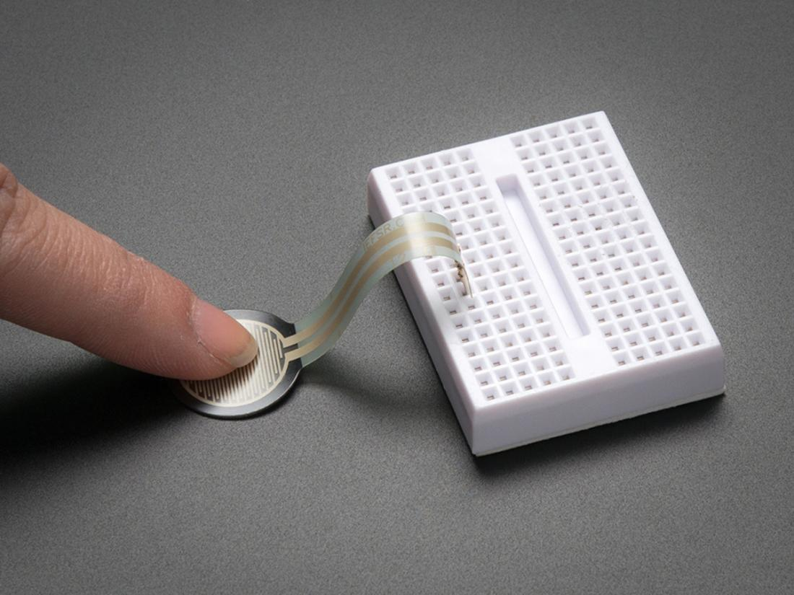

。

1.  **Overview**

In this kit, there is a Keyestudio thin-film pressure sensor, which is
composed of a new type of nano pressure-sensitive material and a
comfortable ultra-thin film substrate, has waterproof and
pressure-sensitive functions.

In the experiment, we determine the pressure by collecting the analog
signal on the S end of the module. The smaller the ADC value, DAC value
and voltage value, the greater the pressure; and the displayed results
will shown on the Shell.

**2. Working Principle**

When the sensor is pressed by external forces, the resistance value of
sensor will vary. We convert the pressure signals detected by the sensor
into the electric signals through a circuit. Then we can obtain the
pressure changes by detecting voltage signal changes.

**3. Components**

<table>
<tbody>
<tr class="odd">
<td></td>
<td></td>
<td></td>
<td></td>
<td></td>
</tr>
<tr class="even">
<td>ESP32 Board*1</td>
<td>ESP32 Expansion Board*1</td>
<td>
Keyestudio

Thin-film Pressure Sensor*1
</td>
<td>3P Dupont Wire*1</td>
<td>Micro USB Cable*1</td>
</tr>
</tbody>
</table>

**4. Connection Diagram**

**5. Test Code**

<table>
<tbody>
<tr class="odd">
<td>
//**********************************************************************************

/*

* Filename : Film pressure sensor

* Description : Read the basic usage of ADC，DAC and Voltage

* Auther : http//www.keyestudio.com

*/

#define PIN_ANALOG_IN 34 //the pin of the Film pressure sensor

void setup() 

//In loop()，the analogRead() function is used to obtain the ADC value,

//and then the map() function is used to convert the value into an 8-bit precision DAC value.

//The input and output voltage are calculated according to the previous formula,

//and the information is finally printed out.

void loop() 

//**********************************************************************************
</td>
</tr>
</tbody>
</table>

**6. Test Result**

Connect the wires according to the experimental wiring diagram, compile
and upload the code to the ESP32. After uploading successfully，we will
use a USB cable to power on, open the serial monitor and set the baud
rate to 9600 and press the reset button on the ESP32.

The serial monitor will display the thin-film’s ADC value, DAC value and
voltage value, when the thin-film is pressed by fingers, the analog
value will decrease, as shown below;

### Project 18: Joystick Module

**1. Overview**

Game handle controllers are ubiquitous. There is a joystick module in
this kit, which mainly uses PS2 joystick. When controlling it, we need
to connect the X and Y ports of the module to the analog port of the
single-chip microcomputer, port B to the digital port of the single-chip
microcomputer, VCC to the power output port(3.3-5V), and GND to the GND
of the MCU. We can read the high and low levels of two analog values and
one digital port) to determine the working status of the joystick on the
module.

In the project, two analog values(x axis and y axis) will be shown on
Shell.

**2. Working Principle**

In fact, its working principle is very simple. Its inside structure is
equivalent to two adjustable potentiometers and a button. When this
button is not pressed and the module is pulled down by R1, low levels
will be output ; on the contrary, when the button is pressed, VCC will
be connected (high levels). When we move the joystick, the internal
potentiometer will adjust to output different voltages, and we can read
the analog value.

**3. Components**

<table>
<tbody>
<tr class="odd">
<td></td>
<td></td>
<td></td>
<td></td>
<td></td>
</tr>
<tr class="even">
<td>ESP32 Board*1</td>
<td>ESP32 Expansion Board*1</td>
<td>Keyestudio Joystick Module*1</td>
<td>5P Dupont Wire*1</td>
<td>Micro USB Cable*1</td>
</tr>
</tbody>
</table>

**4. Connection Diagram**

**5. Test Code**

<table>
<tbody>
<tr class="odd">
<td>
//**********************************************************************************

/*

* Filename : Joystick

* Description : Read data from Rocker.

* Auther : http//www.keyestudio.com

*/

int xyzPins[] = ; //x,y,z pins

void setup() 

// In loop(), use analogRead () to read the value of axes X and Y

//and use digitalRead () to read the value of axis Z, then display them.

void loop() 

//**********************************************************************************
</td>
</tr>
</tbody>
</table>

**6. Code Explanation**

In the experiment, according to the wiring diagram, the x pin is set to
GPIO34, the y pin is set to GPIO35 and the pin of the joystick is set to
GPIO13.

**7. Test Result**

Connect the wires according to the experimental wiring diagram, compile
and upload the code to the ESP32. After uploading successfully，we will
use a USB cable to power on. Open the serial monitor and set baud rate
to 9600.

We need to press the reset button on the ESP32, then the serial monitor
will show the corresponding value. Moving the joystick or pressing it
will change the analog and digital values in the serial monitor .

### Project 19: SK6812 RGB Module

1.  **Overview**

In previous lessons, we learned about the plug-in RGB module and used
PWM signals to color the three pins of the module.

There is a Keyestudio 6812 RGB module whose driving principle is
different from the plug-in RGB module. It can only control with one pin.
This is a set. It is an intelligent externally controlled LED light
source with the control circuit and the light-emitting circuit. Each LED
element is the same as a 5050 LED lamp bead, and each component is a
pixel. There are four lamp beads on the module, which indicates four
pixels.

In the experiment, we make different lights show different colors.

**2. Working Principle**

From the schematic diagram, we can see that these four pixel lighting
beads are all connected in series. In fact, no matter how many they are,
we can use a pin to control a light and let it display any color. The
pixel point contains a data latch signal shaping amplifier drive
circuit, a high-precision internal oscillator and a 12V high-voltage
programmable constant current control part, which effectively ensures
the color of the pixel point light is highly consistent.

The data protocol adopts a single-wire zero-code communication method.
After the pixel is powered up and reset, the S terminal receives the
data transmitted from the controller. The first 24bit data sent is
extracted by the first pixel and sent to the data latch of the pixel.

**3. Components**

<table>
<tbody>
<tr class="odd">
<td></td>
<td></td>
<td></td>
<td></td>
<td></td>
</tr>
<tr class="even">
<td>ESP32 Board*1</td>
<td>ESP32 Expansion Board*1</td>
<td>Keyestudio 6812 RGB Module*1</td>
<td>3P Dupont Wire*1</td>
<td>Micro USB Cable*1</td>
</tr>
</tbody>
</table>

**4. Connection Diagram**

**5. Test Code**

<table>
<tbody>
<tr class="odd">
<td>
//**********************************************************************************

/*

* Filename : sk6812 RGB LED

* Description : turn on sk6812 RGB LED

* Auther : http//www.keyestudio.com

*/

#include &lt;Adafruit_NeoPixel.h&gt;

#define PIN 15

// Parameter 1 = number of pixels in strip

// Parameter 2 = Arduino pin number (most are valid)

// Parameter 3 = pixel type flags, add together as needed:

// NEO_KHZ800 800 KHz bitstream (most NeoPixel products w/WS2812 LEDs)

// NEO_KHZ400 400 KHz (classic 'v1' (not v2) FLORA pixels, WS2811 drivers)

// NEO_GRB Pixels are wired for GRB bitstream (most NeoPixel products)

// NEO_RGB Pixels are wired for RGB bitstream (v1 FLORA pixels, not v2)

Adafruit_NeoPixel strip = Adafruit_NeoPixel(60, PIN, NEO_GRB + NEO_KHZ800);

// IMPORTANT: To reduce NeoPixel burnout risk, add 1000 uF capacitor across

// pixel power leads, add 300 - 500 Ohm resistor on first pixel's data input

// and minimize distance between Arduino and first pixel. Avoid connecting

// on a live circuit...if you must, connect GND first.

void setup() 

void loop() 

// Fill the dots one after the other with a color

void colorWipe(uint32_t c, uint8_t wait) 

}

void rainbow(uint8_t wait) 

strip.show();

delay(wait);

}

}

// Slightly different, this makes the rainbow equally distributed throughout

void rainbowCycle(uint8_t wait) 

strip.show();

delay(wait);

}

}

//Theatre-style crawling lights.

void theaterChase(uint32_t c, uint8_t wait) 

strip.show();

delay(wait);

for (int i=0; i &lt; strip.numPixels(); i=i+3) 

}

}

}

//Theatre-style crawling lights with rainbow effect

void theaterChaseRainbow(uint8_t wait) 

strip.show();

delay(wait);

for (int i=0; i &lt; strip.numPixels(); i=i+3) 

}

}

}

// Input a value 0 to 255 to get a color value.

// The colours are a transition r - g - b - back to r.

uint32_t Wheel(byte WheelPos)  else if(WheelPos &lt; 170)  else 

}

//*************************************************************************************
</td>
</tr>
</tbody>
</table>

7.  **Test Code**

Connect the wires according to the experimental wiring diagram, compile
and upload the code to the ESP32. After uploading successfully，we will
use a USB cable to power on. Then we can see the four RGB LEDs show red,
green, blue and white color.

### Project 20: Rotary Encoder

1.  **Overview**

In this kit, there is a Keyestudio rotary encoder, dubbed as switch
encoder. It is applied to automotive electronics, multimedia audio,
instrumentation, household appliances, smart home, medical equipment and
so on.

In the experiment, it it used for counting. When we rotate the rotary
encoder clockwise, the set data falls by 1; if you rotate it
anticlockwise, the set data is up 1; and when the middle button is
pressed, the value will be show in the serial monitor.

**2. Working Principle**

  

The incremental encoder converts the displacement into a periodic electric signal, and then converts this signal into a counting pulse, and the number of pulses indicates the size of the displacement.

This module mainly uses 20-pulse rotary encoder components. It can calculate the number of pulses output during clockwise and reverse rotation. There is no limit to count rotation. It resets to the initial state, that is, starts counting from 0.           

**3. Components**

<table>
<tbody>
<tr class="odd">
<td></td>
<td></td>
<td></td>
<td></td>
<td></td>
</tr>
<tr class="even">
<td>ESP32 Board*1</td>
<td>ESP32 Expansion Board*1</td>
<td>Keyestudio Rotary Encoder*1</td>
<td>5P Dupont Wire*1</td>
<td>Micro USB Cable*1</td>
</tr>
</tbody>
</table>

**4. Connection Diagram**

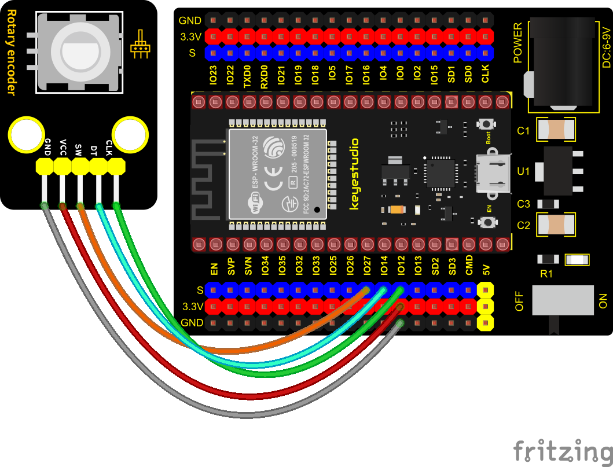

**5. Test Code**

<table>
<tbody>
<tr class="odd">
<td>
//**********************************************************************************

/*

* Filename : Encoder

* Description : Rotary encoder module counting.

* Auther : http//www.keyestudio.com

*/

//Interfacing Rotary Encoder with Arduino

//Encoder Switch -&gt; pin 27

//Encoder DT -&gt; pin 14

//Encoder CLK -&gt; pin 12

int Encoder_DT = 14;

int Encoder_CLK = 12;

int Encoder_Switch = 27;

int Previous_Output;

int Encoder_Count;

void setup() 

void loop() 

else

}

Previous_Output = digitalRead(Encoder_DT);

if (digitalRead(Encoder_Switch) == 0)

}

}

//**********************************************************************************
</td>
</tr>
</tbody>
</table>

**6. Code Explanation**

Set CLK to GPIO12 and DAT to GPIO14.

This code is set well in the library file. When CLK descends, read the
voltage of DAT, when DAT is a HIGH level, the value of the rotary
encoder is added by 1; when DAT is a LOW level, the value of the rotary
encoder is cut down 1.

Set the pin of the button(GPIO27) to LOW and print.

**7. Test Result**

Connect the wires according to the experimental wiring diagram, compile
and upload the code to the ESP32. After uploading successfully，we will
use a USB cable to power on. Open the serial monitor and set baud rate
to 9600.

We need to press the reset button on the ESP32, then rotate the knob on
the rotary encoder clockwise, the displayed data will decrease; on the
contrary, in anticlockwise way, the data will rise. Equally, press the
button on the rotary encoder,“Switch pressed”will be shown.

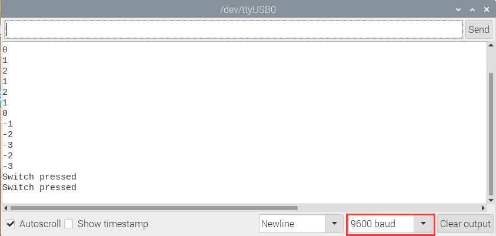

### Project 21: Servo Control

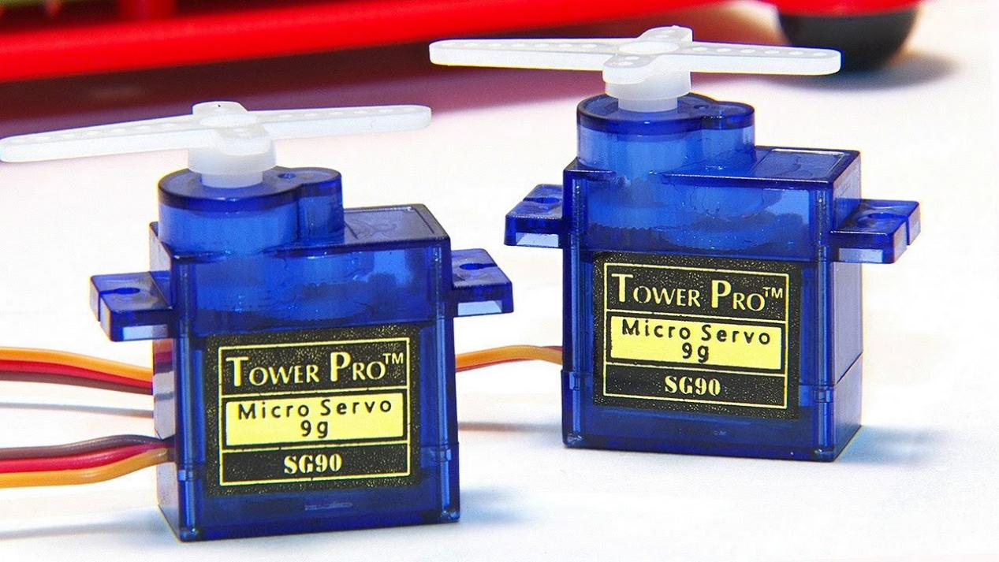

**1. Overview**

Servo is a position control rotary actuator. It mainly consists of a
housing, a circuit board, a core-less motor, a gear and a position
sensor. 

In general, servo has three lines in brown, red and orange. The brown
wire is grounded, the red one is a positive pole line and the orange one
is a signal line.

2.  **Working Principle**

The rotation angle of servo motor is controlled by regulating the duty
cycle of PWM (Pulse-Width Modulation) signal. The standard cycle of PWM
signal is 20ms (50Hz). Theoretically, the width is distributed
between 1ms-2ms, but in fact, it's between 0.5ms-2.5ms. The width
corresponds the rotation angle from 0° to 180°. But note that for
different brand motors, the same signal may have different rotation
angles. 

**3. Components**

<table>
<tbody>
<tr class="odd">
<td></td>
<td></td>
<td></td>
<td></td>
</tr>
<tr class="even">
<td>ESP32 Board*1</td>
<td>ESP32 Expansion Board*1</td>
<td>Servo*1</td>
<td>Micro USB Cable*1</td>
</tr>
</tbody>
</table>

**4. Connection Diagram**

**5. Test Code 1**

<table>
<tbody>
<tr class="odd">
<td>
//**********************************************************************

/*

* Filename : Servo_1

* Description : Steering gear rotation Angle 0-90-180, repeatly

* Auther : http//www.keyestudio.com

*/

int servoPin = 4;//steering gear PIN

void setup() 

void loop() 

void servopulse(int pin, int myangle) 

}

//**********************************************************************
</td>
</tr>
</tbody>
</table>

**6. Code Explanation 1**

**1.** map(value, fromLow, fromHigh, toLow, toHigh)；Value is the value
we map. fromLow, fromHigh is the maximum and minimum value；

toLow, toHigh are the upper limit and lower limit we map. For example,
map(myangle, 0, 180, 500, 2500) means that an angle value myangle
(0°-180°）the mapping range is from 500us to 2500us.

We use the function servopulse() to make the servo move. We also make
the servo rotate 0°, 90°and 180°cyclically.

**7. Test Result 1**

Connect the wires according to the experimental wiring diagram, compile
and upload the code to the ESP32. After uploading successfully，we will
use a USB cable to power on, the servo will rotate 0°，90° and 180°
cyclically.

**8. Test Code 2**

<table>
<tbody>
<tr class="odd">
<td>
//**********************************************************************

/*

* Filename : Servo Sweep

* Description : Control the servo motor for sweeping

* Auther : http//www.keyestudio.com

*/

#include &lt;ESP32Servo.h&gt;

Servo myservo; // create servo object to control a servo

int posVal = 0; // variable to store the servo position

int servoPin = 4; // Servo motor pin

void setup() 

void loop() 

for (posVal = 180; posVal &gt;= 0; posVal -= 1) 

}

//********************************************************************************
</td>
</tr>
</tbody>
</table>

**9. Code Explanation 2**

myservo. write (pos) is the rotation angle to POS.  myservo. read ()
reads the current angle value of the servo.  

**10. Test Result 2**

Connect the wires according to the experimental wiring diagram, compile
and upload the code to the ESP32. After uploading successfully，we will
use a USB cable to power on, the servo will rotate from 0° to 180° by
moving 1° for each 15ms.

### Project 22: Ultrasonic Sensor

Bats and some marine animals are able to use high frequencies of sound
for echolocation or communication. They can emit ultrasonic waves from
the larynx through the mouth or nose and use the sound waves that bounce
back to orient and determine the position, size and whether nearby
objects are moving.

Ultrasonic is a frequency higher than 20000 Hz sound wave, which has a
good direction, a strong penetration ability, and is easy to obtain more
concentrated sound energy as well as spread far in the water. It can be
used for ranging, speed measurement, cleaning, welding, gravel,
sterilization and disinfection. What‘s more, it has many applications in
medicine, military, industry and agriculture.

1.  **Overview**

In this kit, there is a keyes HC-SR04 ultrasonic sensor, which can
detect obstacles in front and the detailed distance between the sensor
and the obstacle. Its principle is the same as that of bat flying. It
can emit the ultrasonic signals that cannot be heard by humans. When
these signals hit an obstacle and come back immediately. The distance
between the sensor and the obstacle can be calculated by the time gap of
emitting signals and receiving signals.

In the experiment, we use the sensor to detect the distance between the
sensor and the obstacle, and print the test result.

**2. Working Principle**

The most common ultrasonic ranging method is the echo detection. As
shown below; when the ultrasonic emitter emits the ultrasonic waves
towards certain direction, the counter will count. The ultrasonic waves
travel and reflect back once encountering the obstacle. Then the counter
will stop counting when the receiver receives the ultrasonic waves
coming back.

The ultrasonic wave is also sound wave, and its speed of sound V is
related to temperature. Generally, it travels 340m/s in the air.
According to time t, we can calculate the distance s from the emitting
spot to the obstacle.

s=340t/2.

The HC-SR04 ultrasonic ranging module can provide a non-contact distance
sensing function of 2cm-400cm, and the ranging accuracy can reach as
high as 3mm; the module includes an ultrasonic transmitter, receiver and
control circuit. Basic working principle:

1\. First pull down the TRIG, and then trigger it with at least 10us
high level signal;

2\. After triggering, the module will automatically transmit eight 40KHZ
square waves, and automatically detect whether there is a signal to
return.

3\. If there is a signal returned back, through the ECHO to output a
high level, the duration time of high level is actually the time from
emission to reception of ultrasonic.

Test distance = high level duration \* 340m/s \* 0.5.

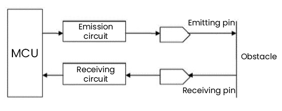

**3. Components**

<table>
<tbody>
<tr class="odd">
<td></td>
<td></td>
<td></td>
<td></td>
<td></td>
</tr>
<tr class="even">
<td>ESP32 Board*1</td>
<td>ESP32 Expansion Board*1</td>
<td>keyestudio SR01 Ultrasonic Sensor*1</td>
<td>4P Dupont Wire*1</td>
<td>Micro USB Cable*1</td>
</tr>
</tbody>
</table>

**4. Connection Diagram**

**5. Test Code**

<table>
<tbody>
<tr class="odd">
<td>
//**********************************************************************************

/*

* Filename : Ultrasonic

* Description : Use the ultrasonic module to measure the distance.

* Auther : http//www.keyestudio.com

*/

const int TrigPin = 13; // define TrigPin

const int EchoPin = 14; // define EchoPin.

int duration = 0; // Define the initial value of the duration to be 0

int distance = 0;//Define the initial value of the distance to be 0

void setup()

void loop()

//**********************************************************************************
</td>
</tr>
</tbody>
</table>

**6. Test Result**

Connect the wires according to the experimental wiring diagram, compile
and upload the code to the ESP32. After uploading successfully，we will
use a USB cable to power on. Open the serial monitor and set baud rate
to 9600.

We need to press the reset button on the ESP32, then the serial monitor
will print the distance between the ultrasonic sensor and the object.

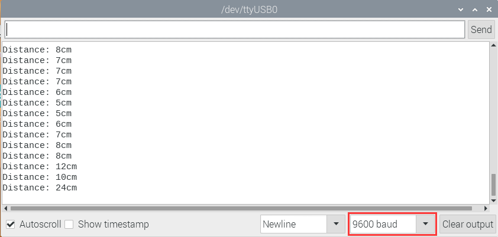

### Project 23: IR Receiver Module

**1. Overview**

Infrared remote control is currently the most widely used means of
communication and remote control, which has the characteristics of small
volume, low power consumption, strong function and low cost. Therefore,
recorder, audio equipment, air conditioning machine and toys and other
small electrical devices have also used the infrared remote control.

Its transmitting circuit is the use of infrared light emitting diode to
emit modulated infrared light wave. The circuit is composed of infrared
receiving diode, triode or silicon photocell. They convert infrared
light emitted by infrared emitter into corresponding electrical signal,
and then send back amplifier.    

In this experiment, we need to know how to use the infrared receiving
sensor, which mainly uses the VS1838B infrared receiving sensor element.
It integrates receiving, amplifying, and demodulating. The internal IC
has already completed the demodulation, and the output is a digital
signal. It can receive 38KHz modulated remote control signal.

In the experiment, we use the IR receiver to receive the infrared signal
emitted by the external infrared transmitting device, and display the
received signal in the shell.

**2. Working Principle**

The main part of the IR remote control system is
modulation, transmission and reception. The modulated carrier frequency
is generally between 30khz and 60khz, and most of them use a square wave
of 38kHz and a duty ratio of 1/3. A 4.7K pull-up resistor R3 is added to
the signal end of the infrared receiver.

**3. Components**

<table>
<tbody>
<tr class="odd">
<td>\</td>
<td></td>
<td></td>
<td></td>
<td></td>
<td></td>
</tr>
<tr class="even">
<td>ESP32 Board*11</td>
<td>ESP32 Expansion Board*1</td>
<td>
Keyestudio DIY

IR Receiver*1
</td>
<td>3P Dupont Wire*1</td>
<td>Micro USB Cable*1</td>
<td>Remote Control*1</td>
</tr>
</tbody>
</table>

**4. Connection Diagram**

**5. Test Code**

<table>
<tbody>
<tr class="odd">
<td>
//**********************************************************************************

/*

* Filename : IR Receiver

* Description : Decode the infrared remote control and print it out through the serial port.

* Auther : http//www.keyestudio.com

*/

#include &lt;Arduino.h&gt;

#include &lt;IRremoteESP8266.h&gt;

#include &lt;IRrecv.h&gt;

#include &lt;IRutils.h&gt;

const uint16_t recvPin = 15; // Infrared receiving pin

IRrecv irrecv(recvPin); // Create a class object used to receive class

decode_results results; // Create a decoding results class object

void setup() 

void loop() 

delay(1000);

}

//**********************************************************************************
</td>
</tr>
</tbody>
</table>

**6. Test Result**

Connect the wires according to the experimental wiring diagram, compile
and upload the code to the ESP32. After uploading successfully，we will
use a USB cable to power on. Open the serial monitor and set baud rate
to 9600.

We need to press the reset button on the ESP32, then find the infrared
remote control, pull out the insulating sheet, and press the button at
the receiving head of the infrared receiving sensor. After receiving the
signal, the serial monitor will print the currently received button
value and the LED on the infrared receiving sensor also starts to flash,
as shown in the figure below.

Write down the key code value associated with the infrared remote with
each key, as you will need this information later. 

### Project 24: DS1307 Clock Module

1.  **Overview**

This module mainly uses the real-time clock chip DS1307, which is the
I2C bus interface chip that has second, minute, hour, day, month, year
and other functions as well as leap year automatic adjustment function
introduced by DALLAS. It can work independently of CPU, and won‘t’
affected by the CPU main crystal oscillator and capacitance as well as
keep accurate time.

What‘s more, monthly cumulative error is generally less than 10 seconds.
The chip also has a clock protection circuit in case of main power
failure and runs on a back-up battery that denies the CPU read and write
access. At the same time, it contains automatic switching control
circuit of standby power supply, so it can guarantee the accuracy of
system clock in case of power failure of main power supply and other bad
environment.

Going forward, the DS1307 chip internal integration has a certain
capacity, with power failure protection characteristics of static RAM,
which can be used to save some key data. 

In the experiment, we use the DS1307 clock module to obtain the system
time and print the test results.  

**2. Working Principle**

Serial real-time clock records year, month, day, hour, minute, second
and week; AM and PM indicate morning and afternoon respectively; 56
bytes of NVRAM store data; 2-wire serial port; programmable square wave
output; power failure detection and automatic switching circuit; battery
current is less than 500nA.

Pins description：X1, 32.768kHz crystal terminal
;

VBAT:X2：+3V input;

SDA：serial data;

SCL：serial clock;

SQW/OUT：square waves/output drivers

**3. Components**

<table>
<tbody>
<tr class="odd">
<td></td>
<td></td>
<td></td>
<td></td>
<td></td>
</tr>
<tr class="even">
<td>ESP32 Board*1</td>
<td>ESP32 Expansion Board*1</td>
<td>Keyestudio DS1307 Clock Module*1</td>
<td>4P Dupont Wire*1</td>
<td>Micro USB Cable*1</td>
</tr>
</tbody>
</table>

**4. Connection Diagram**

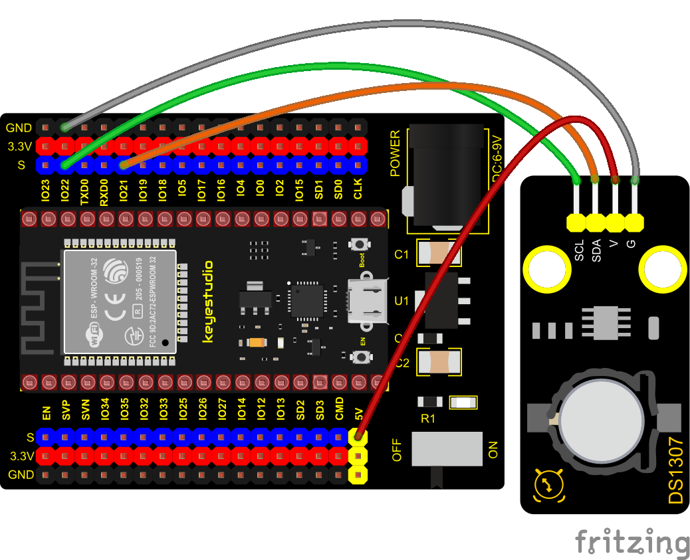**5. Test Code**

<table>
<tbody>
<tr class="odd">
<td>
//**********************************************************************************

/*

* Filename : DS1307 Real Time Clock

* Description : Read the year/month/day/hour/minute/second/week of DS1307 clock module

* Auther : http//www.keyestudio.com

*/

#include &lt;Wire.h&gt;

#include "RtcDS1307.h" //DS1307 clock module library

RtcDS1307&lt;TwoWire&gt; Rtc(Wire);//i2cport

void setup()

void loop()

//**********************************************************************************
</td>
</tr>
</tbody>
</table>

**6. Code Explanation**

Rtc.GetDateTime(): the obtained current time and date.

**Rtc.Begin();**enable DS1307 real-time clock

**Rtc.SetIsRunning(true);** run the DS1307 real-time clock, if true
changes into false, time will stop.

**Rtc.SetDateTime()；**set time

**Rtc.GetDateTime().Year()** return year

**Rtc.GetDateTime().Month()** return month

**Rtc.GetDateTime().Day()**return date

**Rtc.GetDateTime().Hour()**return hour

**Rtc.GetDateTime().Minute()**return minute

**Rtc.GetDateTime().Second()**return second

**Rtc.GetDateTime().DayOfWeek() return week**

**7. Test Result**

Connect the wires according to the experimental wiring diagram, attach
the DS1307 sensor to a battery, compile and upload the code to the
ESP32. After uploading successfully，we will use a USB cable to power on.
Open the serial monitor and set baud rate to 9600.

We need to press the reset button on the ESP32, then we can see the
displayed year, month, day, hour, minute, second and week on the
monitor, and set the time and date to refresh every second, as shown
below:

### Project 25: TM1650 4-Digit Tube Display

**1. Overview**

This module is mainly composed of a 0.36 inch red common anode 4-digit
digital tube, and its driver chip is TM1650. When using it, we only need
two signal lines to make the single-chip microcomputer control a
4-bitdigit tube, which greatly saves the IO port resources of the
control board.

TM1650 is a special circuit for LED (light emitting diode display) drive
control. It integrates MCU input and output control digital interface,
data latch, LED drivers, keyboard scanning, brightness adjustment and
other circuits.

TM1650 has stable performance, reliable quality and strong
anti-interference ability.

It can be applied to the application of long-term continuous working for
24 hours.

TM1650 uses 2-wire serial transmission protocol for communication (note
that this data transmission protocol is not a standard I2C protocol).
The chip can drive the digital tube and save MCU pin resources through
two pins and MCU communication.

**2. Working Principle**

TM1650 adopts IIC treaty, which uses DIO and CLK buses.

**Data command setting**: 0x48 means that we light up the digital tube,
instead of enable the function of key scanning

**Command display setting:**

bit\[6:4\]: set the brightness of tube display, and 000 is brightest

bit\[3\]: set to show decimal points

bit\[0\]: start the display of the tube display

**3. Components**

<table>
<tbody>
<tr class="odd">
<td></td>
<td></td>
<td></td>
<td></td>
<td></td>
</tr>
<tr class="even">
<td>ESP32 Board*1</td>
<td>ESP32 Expansion Board*1</td>
<td>Keyestudio TM16504-Digit Segment Display*1</td>
<td>4P Dupont Wire*1</td>
<td>Micro USB Cable*1</td>
</tr>
</tbody>
</table>

**4. Connection Diagram**

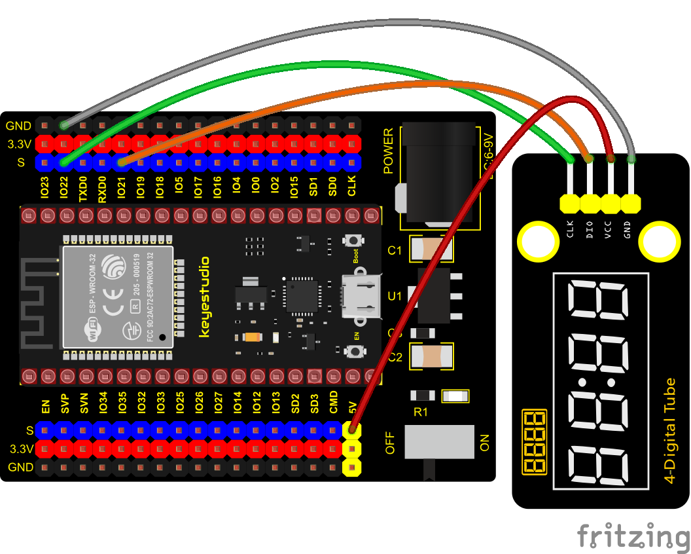

**5. Test Code**

<table>
<tbody>
<tr class="odd">
<td>
//**********************************************************************************

/*

* Filename : TM1650 Four digital tube

* Description : TM1650 Four Digital Tube shows 0-9999

* Auther : http//www.keyestudio.com

*/

#include "TM1650.h"

#define CLK 22 //pins definitions for TM1650 and can be changed to other ports

#define DIO 21

TM1650 DigitalTube(CLK,DIO);

void setup()

// DigitalTube.displayDot(1,true); //Bit0 display dot. Use before displayBit().

DigitalTube.displayBit(1,0); //DigitalTube.Display(bit,number); bit=0---3 number=0---9

}

void loop()

}

void displayFloatNum(float num)

if(dat%10000/1000 != 0)

if(dat%1000/100 != 0)

DigitalTube.clearBit(1);

DigitalTube.clearBit(2);

DigitalTube.clearBit(3);

DigitalTube.displayBit(4, dat%100/10);

}

//**********************************************************************************
</td>
</tr>
</tbody>
</table>

**6. Code Explanation**

**.init()**; Initialize TM1650

**.clear();** Clear digit tube display

.displayString(char \*aString); Display string，\*aString refers to the
content of the string aString.

**.displayString(String sString);** Display string，sString is the string

**.displayString(float value);** Display decimals as float

**.displayString(double value);**Display decimals as double

**.displayString(int value);** Displays an integer of type int

**.displayOn();**Open the digit tube display

**.displayOff();**Close the digit tube display, once closed you must
call.displayon (); to redisplay

**.setDot(unsigned int aPos, bool aState);**Display the decimal point,
aPos is the position of the decimal point (0\~3) corresponding to
(1\~4), aState is the display state: 1 (true) on, 2 (false) off.  

**.setBrightness(unsigned int iBrightness);**Set the iBrightness value
to 1\~8. The type is unsigned Int. Set it to 1 if it is less than 1 or 8
if greater than 8.  

**7. Test Result**

Connect the wires according to the experimental wiring diagram, compile
and upload the code to the ESP32. After uploading successfully，we will
use a USB cable to power on. The 4-digit tube display will show integer
from 0 to 99999, add 1 for each 10ms. Increase to 9999 then start from
0.

### Project 26: HT16K33\_8X8 Dot Matrix Module

1.  **Overview**

What is the dot matrix display?

The 8X8 dot matrix is composed of 64 light-emitting diodes, and each
light-emitting diode is placed at the intersection of the row line and
the column line. When the corresponding row is set to 1 level, and a
certain column is set to 0 level, the corresponding diode will light up.

**2. Working Principle**

As the schematic diagram shown, to light up the LED at the first row and
column, we only need to set C1 to high level and R1 to low level. To
turn on LEDs at the first row, we set R1 to low level and C1-C8 to high
level.

16 IO ports are needed, which will highly waste the MCU resources.

Therefore, we designed this module, using the HT16K33 chip to drive an
8\*8 dot matrix, which greatly saves the resources of the single-chip
microcomputer.

There are three DIP switches on the module, all of which are set to I2C
communication address. The setting method is shown below. A0，A1 and A2
are grounded, that is, the address is 0x70

<table>
<tbody>
<tr class="odd">
<td>A0（1）</td>
<td>A1（2）</td>
<td>A2（3）</td>
<td>A0（1）</td>
<td>A1（2）</td>
<td>A2（3）</td>
<td>A0（1）</td>
<td>A1（2）</td>
<td>A2（3）</td>
</tr>
<tr class="even">
<td>0（OFF）</td>
<td>0（OFF）</td>
<td>0（OFF）</td>
<td>1（ON）</td>
<td>0（OFF）</td>
<td>0（OFF）</td>
<td>0（OFF）</td>
<td>1（ON）</td>
<td>0（OFF）</td>
</tr>
<tr class="odd">
<td>OX70</td>
<td>OX71</td>
<td>OX72</td>
<td></td>
<td></td>
<td></td>
<td></td>
<td></td>
<td></td>
</tr>
<tr class="even">
<td>A0（1）</td>
<td>A1（2）</td>
<td>A2（3）</td>
<td>A0（1）</td>
<td>A1（2）</td>
<td>A2（3）</td>
<td>A0（1）</td>
<td>A1（2）</td>
<td>A2（3）</td>
</tr>
<tr class="odd">
<td>1（ON）</td>
<td>1（ON）</td>
<td>0（OFF）</td>
<td>0（OFF）</td>
<td>0（OFF）</td>
<td>1（ON）</td>
<td>1（ON）</td>
<td>0（OFF）</td>
<td>1（ON）</td>
</tr>
<tr class="even">
<td>OX73</td>
<td>OX74</td>
<td>OX75</td>
<td></td>
<td></td>
<td></td>
<td></td>
<td></td>
<td></td>
</tr>
<tr class="odd">
<td>A0（1）</td>
<td>A1（2）</td>
<td>A2（3）</td>
<td>A0（1）</td>
<td>A1（2）</td>
<td>A2（3）</td>
<td></td>
<td></td>
<td></td>
</tr>
<tr class="even">
<td>0（OFF）</td>
<td>1（ON）</td>
<td>1（ON）</td>
<td>1（ON）</td>
<td>1（ON）</td>
<td>1（ON）</td>
<td></td>
<td></td>
<td></td>
</tr>
<tr class="odd">
<td>OX76</td>
<td>OX77</td>
<td></td>
<td></td>
<td></td>
<td></td>
<td></td>
<td></td>
<td></td>
</tr>
</tbody>
</table>

**3. Components**

<table>
<tbody>
<tr class="odd">
<td></td>
<td></td>
<td></td>
<td></td>
<td></td>
</tr>
<tr class="even">
<td>ESP32 Board*1</td>
<td>ESP32 Expansion Board*1</td>
<td>
Keyestudio HT16K33_

8X8 Dot Matrix*1
</td>
<td>4P Dupont Wire*1</td>
<td>Micro USB Cable*1</td>
</tr>
</tbody>
</table>

**4. Connection Diagram**

**5. Test Code**

<table>
<tbody>
<tr class="odd">
<td>
//**********************************************************************************

/*

* Filename : 8×8 Dot-matrix Display

* Description : 8x8 LED dot matrix display“Heart” pattern.

* Auther : http//www.keyestudio.com

*/

#include "HT16K33_Lib_For_ESP32.h"

#define SDA 21

#define SCL 22

ESP32_HT16K33 matrix = ESP32_HT16K33();

//The brightness values can be set from 1 to 15, with 1 darkest and 15 brightest

#define A 15

byte result[8][8];

byte test1[8] = ;

void setup()

void loop()

for (int i = 7; i &gt; 0; i--)

}

//**********************************************************************************
</td>
</tr>
</tbody>
</table>

**6. Code Explanation**

First we need to import the library file.

The pattern in our code is an array of byte data type, which is shown in
the table below. We convert 
into binary, and fill in the 8\*8 form below to make it clear. 1 means
on, 0 means off. Then we can see that it is a smile shape.

<table>
<tbody>
<tr class="odd">
<td>0</td>
<td>0</td>
<td>0</td>
<td>0</td>
<td>0</td>
<td>0</td>
<td>0</td>
<td>0</td>
</tr>
<tr class="even">
<td>0</td>
<td>1</td>
<td>1</td>
<td>0</td>
<td>0</td>
<td>1</td>
<td>1</td>
<td>0</td>
</tr>
<tr class="odd">
<td>0</td>
<td>0</td>
<td>0</td>
<td>0</td>
<td>0</td>
<td>0</td>
<td>0</td>
<td>0</td>
</tr>
<tr class="even">
<td>0</td>
<td>0</td>
<td>0</td>
<td>0</td>
<td>0</td>
<td>0</td>
<td>0</td>
<td>0</td>
</tr>
<tr class="odd">
<td>0</td>
<td>0</td>
<td>0</td>
<td>1</td>
<td>1</td>
<td>0</td>
<td>0</td>
<td>0</td>
</tr>
<tr class="even">
<td>0</td>
<td>0</td>
<td>0</td>
<td>0</td>
<td>0</td>
<td>0</td>
<td>0</td>
<td>0</td>
</tr>
<tr class="odd">
<td>0</td>
<td>1</td>
<td>0</td>
<td>0</td>
<td>0</td>
<td>0</td>
<td>1</td>
<td>0</td>
</tr>
<tr class="even">
<td>0</td>
<td>0</td>
<td>1</td>
<td>1</td>
<td>1</td>
<td>1</td>
<td>0</td>
<td>0</td>
</tr>
</tbody>
</table>

**7. Test Result**

Connect the wires according to the experimental wiring diagram, compile
and upload the code to the ESP32. After uploading successfully，we will
use a USB cable to power on. Then the dot matrix displays a “ smile
”pattern.

**5. Comprehensive Experiments**

The previous projects are related to single sensor or module. In the
following part, we will combine various sensors and modules to create
some comprehensive experiments to perform special functions.

### Project 27: Button-controlled LED

**1. Overview**

In this lesson, we will make an extension experiment with a button and
an LED. When the button is pressed and low levels are output, the LED
will light up; when the button is released, the LED will go off. Then we
can control a module with another module.

**2. Components**

<table>
<tbody>
<tr class="odd">
<td></td>
<td></td>
<td></td>
<td></td>
<td></td>
<td></td>
</tr>
<tr class="even">
<td>ESP32 Board*1</td>
<td>ESP32 Expansion Board*1</td>
<td>Keyestudio Purple LED Module*1</td>
<td>Keyestudio DIY Button Module*1</td>
<td>3P Dupont Wire*2</td>
<td>Micro USB Cable*1</td>
</tr>
</tbody>
</table>

**3. Connection Diagram**

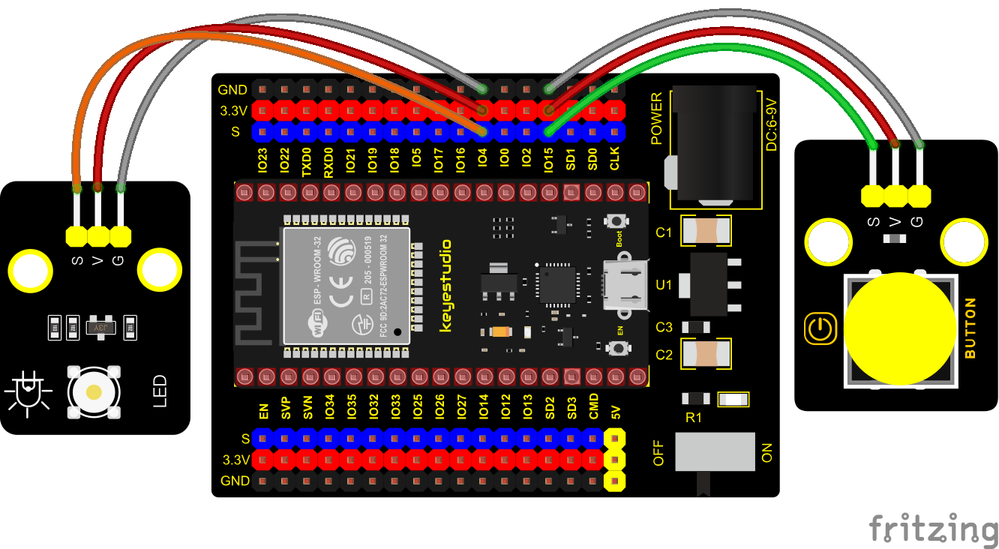

**4. Test Code**

<table>
<tbody>
<tr class="odd">
<td>
//**********************************************************************

/*

* Filename : button_control_LED

* Description : Make a table lamp.

* Auther : http//www.keyestudio.com

*/

#define PIN_LED 4

#define PIN_BUTTON 15

bool ledState = false;

void setup() 

// the loop function runs over and over again forever

void loop() 

while (digitalRead(PIN_BUTTON) == LOW);

}

}

void reverseGPIO(int pin) 

//**********************************************************************
</td>
</tr>
</tbody>
</table>

5.  **Test Result**

Connect the wires according to the experimental wiring diagram, compile
and upload the code to the ESP32. After uploading successfully，we will
use a USB cable to power on. When the button is pressed, the LED will
light up; when pressed again, the LED will go off.

### Project 28: Alarm Experiment

1.  **Overview**

In the previous experiment, we control an output module though an input
module. In this lesson, we will make an experiment that the active
buzzer will emit sounds once an obstacle appears.

**2. Components**

<table>
<tbody>
<tr class="odd">
<td></td>
<td></td>
<td></td>
<td></td>
<td></td>
<td></td>
</tr>
<tr class="even">
<td>ESP32 Board*1</td>
<td>ESP32 Expansion Board*1</td>
<td>Keyestudio Obstacle Avoidance Sensor*1</td>
<td>Keyestudio Active Buzzer*1</td>
<td>3P Dupont Wire*2</td>
<td>Micro USB Cable*1</td>
</tr>
</tbody>
</table>

**3. Connection Diagram**

**4. Test Code**

<table>
<tbody>
<tr class="odd">
<td>
//**********************************************************************************

/*

* Filename : Avoiding alarm

* Description : Obstacle avoidance sensor controls the buzzer

* Auther : http//www.keyestudio.com

*/

int item = 0;

void setup() 

void loop()  else 

delay(100);//Delay 100ms

}

//**********************************************************************************
</td>
</tr>
</tbody>
</table>

**5. Code Explanation**

Set IO ports according to connection diagram then configure pins mode

The value is 0 when pressing the button, So, we can determine the key
value(0）through if (item == 0) and make the buzzer beep digitalWrite(4,
HIGH).

**6. Test Result**

Connect the wires according to the experimental wiring diagram, compile
and upload the code to the ESP32. After uploading successfully，we will
use a USB cable to power on. If the obstacle is detected, the active
buzzer will chime; if not, it won’t beep.

### Project 29: Intrusion Detection

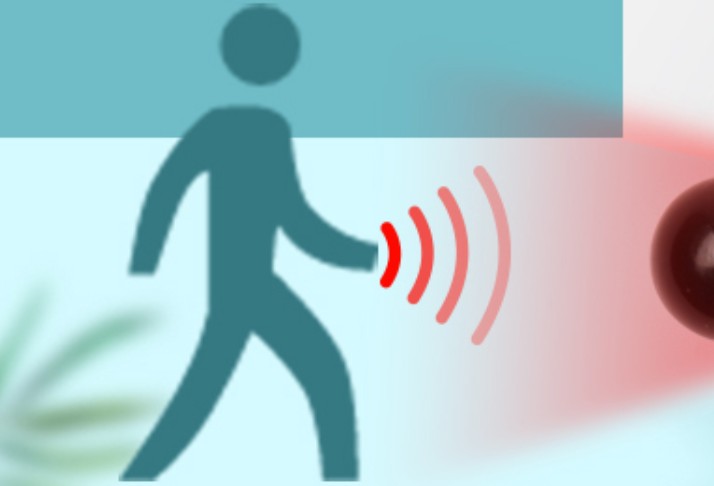

1.  **Description**

In this experiment, we use a PIR motion sensor to control an active
buzzer to emit sounds and the onboard LED to flash rapidly.

**2. Required Components**

<table>
<tbody>
<tr class="odd">
<td></td>
<td></td>
<td></td>
<td></td>
</tr>
<tr class="even">
<td>ESP32 Board*1</td>
<td>ESP32 Expansion Board*1</td>
<td>Keyestudio DIY PIR Motion Sensor*1</td>
<td>Keyestudio DIY Active Buzzer*1</td>
</tr>
<tr class="odd">
<td></td>
<td></td>
<td></td>
<td></td>
</tr>
<tr class="even">
<td>Keyestudio Purple LED Module*1</td>
<td>3P Dupont Wire*3</td>
<td>Micro USB Cable*1</td>
<td></td>
</tr>
</tbody>
</table>

**3. Connection Diagram**

**4. Test Code**

<table>
<tbody>
<tr class="odd">
<td>
//**********************************************************************************

/*

* Filename : PIR alarm

* Description : PIR control buzzer

* Auther : http//www.keyestudio.com

*/

int item = 0;

void setup() 

void loop()  else 

}

//**********************************************************************************
</td>
</tr>
</tbody>
</table>

**5. Test Result**

Connect the wires according to the experimental wiring diagram, compile
and upload the code to the ESP32. After uploading successfully，we will
use a USB cable to power on. If the sensor detects people moving, the
buzzer will emit an alarm , and the LED will flash continuously.

### Project 30: Rotary Encoder control RGB

1.  **Introduction**

In this lesson, we will control the LED on the RGB module to show
different colors through a rotary encoder.

When designing the code, we need to divide the obtained values by 3 to
get the remainders. The remainder is 0 and the LED will become red. The
remainder is 1, the LED will become green. The remainder is 2, the LED
will turn blue.

**2. Components**

<table>
<tbody>
<tr class="odd">
<td></td>
<td></td>
<td></td>
<td></td>
</tr>
<tr class="even">
<td>ESP32Board*1</td>
<td>ESP32 Expansion Board*1</td>
<td>
Keyestudio

Common Cathode RGB Module*1
</td>
<td>
Keyestudio

Rotary Encoder Module*1
</td>
</tr>
<tr class="odd">
<td></td>
<td></td>
<td></td>
<td></td>
</tr>
<tr class="even">
<td>5P Dupont Wire*1</td>
<td>4P Dupont Wire*1</td>
<td>Micro USB Cable*1</td>
<td></td>
</tr>
</tbody>
</table>

**3. Connection Diagram**

**  
**

4.  **Test Code**

<table>
<tbody>
<tr class="odd">
<td>
//**********************************************************************************

/*

* Filename : Encoder control RGB

* Description : Rotary encoder controls RGB to present different effects

* Auther : http//www.keyestudio.com

*/

//Interfacing Rotary Encoder with Arduino

//Encoder Switch -&gt; pin 27

//Encoder DT -&gt; pin 14

//Encoder CLK -&gt; pin 12

int Encoder_DT = 14;

int Encoder_CLK = 12;

int Encoder_Switch = 27;

int Previous_Output;

int Encoder_Count;

int ledPins[] = ; //define red, green, blue led pins

const byte chns[] = ; //define the pwm channels

int red, green, blue;

int val;

void setup() 

}

void loop() 

else

}

Previous_Output = digitalRead(Encoder_DT);

if (digitalRead(Encoder_Switch) == 0)

}

if (val == 0)  else if (val == 1)  else 

}

//**********************************************************************************
</td>
</tr>
</tbody>
</table>

5.  **Code Explanation**

<!-- end list -->

1.  In the experiment, we set the val to the remainder of Encoder\_Count
    divided by 3. Encoder\_Count is the value of the encoder. Then we
    can set pin GPIO0 (red), GPIO2 (green) and GPIO15 (blue) according
    to remainders.
    
    2\. Referring to the control method learned in the previous
    experiment, use the LED on the remainder control module to display
    the corresponding light color. The value obtained by taking the
    remainder of 3 for any number is 0 or 1 or 2. We use these three
    values to judge, and display the corresponding color.

<!-- end list -->

6.  **Test Result**

Connect the wires according to the experimental wiring diagram, compile
and upload the code to the ESP32. After uploading successfully，we will
use a USB cable to power on. Open the serial monitor and set the baud
rate to 9600. We need to press the reset button on the ESP32, then
rotate the knob of the rotary encoder to display the reminders, which
can control colors of LED(red green blue).

### Project 31: Rotary Potentiometer

1.  **Introduction**

In the previous courses, we did experiments of breathing light and
controlling LED with button. In this course, we do these two experiments
by controlling the brightness of LED through an adjustable
potentiometer. The brightness of LED is controlled by PWM values, and
the range of analog values is 0 to 4095 and the PWM value range is
0-255.

After the code is set successfully, we can control the brightness of the
LED on the module by rotating the potentiometer.

**2. Required Components**

<table>
<tbody>
<tr class="odd">
<td></td>
<td></td>
<td></td>
<td></td>
<td></td>
<td></td>
</tr>
<tr class="even">
<td>ESP32 Board*1</td>
<td>ESP32 Expansion Board*1</td>
<td>Keyestudio Purple LED*1</td>
<td>Keyestudio Rotary Potentiometer*1</td>
<td>3P Dupont Wire*2</td>
<td>Micro USB Cable*1</td>
</tr>
</tbody>
</table>

**3. Connection Diagram**

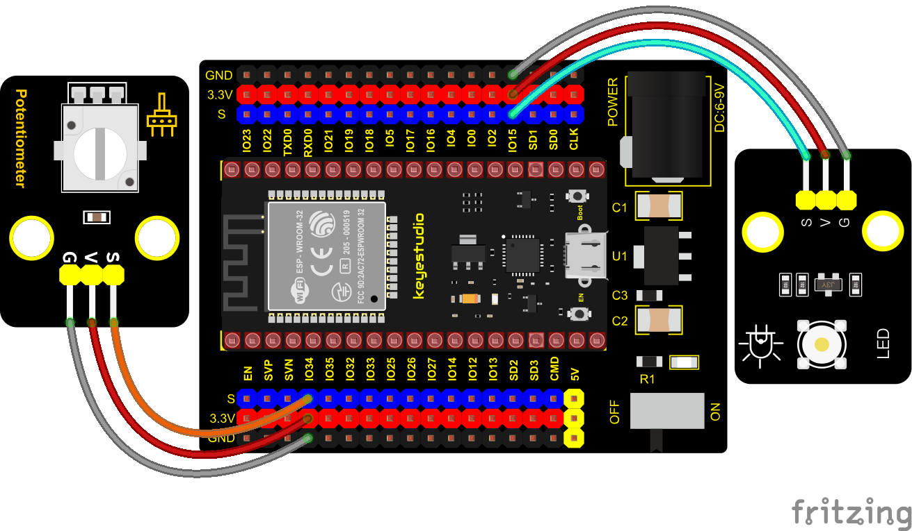

**4. Test Code**

<table>
<tbody>
<tr class="odd">
<td>
//**********************************************************************************

/*

* Filename : adjust the light

* Description : Controlling the brightness of LED by potentiometer.

* Auther : http//www.keyestudio.com

*/

#define PIN_ANALOG_IN 34 //the pin of the potentiometer

#define PIN_LED 15 // the pin of the LED

#define CHAN 0

void setup() 

void loop() 

//**********************************************************************************
</td>
</tr>
</tbody>
</table>

**5. Code Explanation**

In the experiment, the mapping function maps adcVal from the range of
0-4095 to 0-255, and assigns it to pwmVal.

**6. Test Result**

Connect the wires according to the experimental wiring diagram, compile
and upload the code to the ESP32. After uploading successfully，we will
use a USB cable to power on. Rotating the potentiometer on the module
can adjust the brightness of the LED on the LED module.

### Project** **32: Sound Activated Light

1.  **Introduction**

In this lesson, we will make a smart sound activated light using a sound
sensor and an LED module. When we make a sound, the light will
automatically turn on; when there is no sound, the light will
automatically turn off. How it works? Because the sound-controlled light
is equipped with a sound sensor, and this sensor converts the intensity
of external sound into a corresponding value. Then set a threshold, when
the threshold is exceeded, the light will will go out, and when it is
not exceeded, the light will turn on.

**2. Components**

<table>
<tbody>
<tr class="odd">
<td></td>
<td></td>
<td></td>
<td></td>
<td></td>
<td></td>
</tr>
<tr class="even">
<td>ESP32 Board*1</td>
<td>ESP32 Expansion Board*1</td>
<td>Keyestudio Sound Sensor*1</td>
<td>Keyestudio Purple LED Module*1</td>
<td>3P Dupont Wire*2</td>
<td>
MicroUSB

Cable*1
</td>
</tr>
</tbody>
</table>

**3. Connection Diagram**

**4. Test Code**

<table>
<tbody>
<tr class="odd">
<td>
//**********************************************************************************

/*

* Filename : sound-controlled lights

* Description : Sound sensor controls LED on and off

* Auther : http//www.keyestudio.com

*/

int ledPin = 15;//LED is connected to GP15

int microPin = 34;//Sound sensor is connected to GPIO34

void setup() 

void loop() else

delay(100);

}

//**********************************************************************************
</td>
</tr>
</tbody>
</table>

**5. Code Explanation**

We set the ADC threshold value to 600. If more than 600, LED will be on
3s; on the contrary, it will be off.

**6. Test Result**

Connect the wires according to the experimental wiring diagram, compile
and upload the code to the ESP32. After uploading successfully，we will
use a USB cable to power on. Open the serial monitor and set the baud
rate to 9600.

We need to press the reset button on the ESP32, then the corresponding
volume ADC value will be displayed. When the analog value of sound is
greater than 600, the LED on the LED module will light up, otherwise it
will go off.

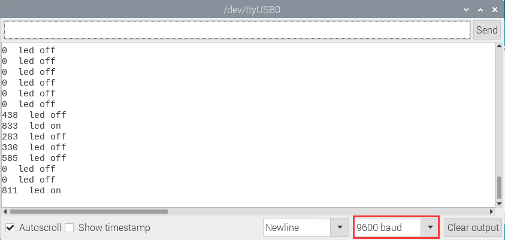

### Project 33: Ultrasonic Radar

1.  **Description**

We know that bats use echoes to determine the direction and the location
of their preys. In real life, sonar is used to detect sounds in the
water. Since the attenuation rate of electromagnetic waves in water is
very high, it cannot be used to detect signals, however, the attenuation
rate of sound waves in the water is much smaller, so sound waves are
most commonly used underwater for observation and measurement.

In this experiment, we will use a speaker module, an RGB module and a
4-digit tube display to make a device for detection through ultrasonic.

**2. Required Components**

<table>
<tbody>
<tr class="odd">
<td></td>
<td></td>
<td></td>
<td></td>
<td></td>
</tr>
<tr class="even">
<td>ESP32 Board*1</td>
<td>ESP32 Expansion Board*1</td>
<td>Keyestudio HC-SR04 Ultrasonic Sensor*1</td>
<td>Keyestudio 8002b Power Amplifier*1</td>
<td>Keyestudio DIY Common Cathode RGB Module *1</td>
</tr>
<tr class="odd">
<td></td>
<td></td>
<td></td>
<td></td>
<td></td>
</tr>
<tr class="even">
<td>Keyestudio DIY TM1650 4-Digit Tube Display*1</td>
<td>4P Dupont Wire*3</td>
<td>3P Dupont Wire*1</td>
<td>Micro USB Cable*1</td>
<td></td>
</tr>
</tbody>
</table>

**3. Connection Diagram**

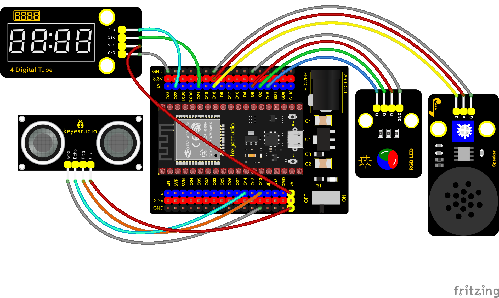

**4. Test Code**

<table>
<tbody>
<tr class="odd">
<td>
//**********************************************************************************

/*

* Filename : Ultrasonic radar

* Description : Ultrasonic control four digit tube, buzzer and RGB analog ultrasonic radar.

* Auther : http//www.keyestudio.com

*/

#include "TM1650.h" //Import the TM1650 library file

//the interfaces are GPIO21 and GPIO22

#define DIO 21

#define CLK 22

TM1650 DigitalTube(CLK,DIO);

int beeppin = 18; //Define the horn pin as GPIO18

int TrigPin = 13; //Set the Trig pin to GPIO13

int EchoPin = 14; //Set the Echo pin to GPIO14

int distance;//Distance measured by ultrasound

int ledPins[] = ; //define red, green, blue led pins

const byte chns[] = ; //define the pwm channels

float checkdistance() 

void setup() 

// DigitalTube.displayDot(1,true); //Bit0 display dot. Use before displayBit().

DigitalTube.displayBit(1,0); //DigitalTube.Display(bit,number); bit=0---3 number=0---9

pinMode(TrigPin, OUTPUT);//Sets the Trig pin as output

pinMode(EchoPin, INPUT); //Set the Echo pin as input

ledcSetup(3, 1000, 8);//setup the pwm channels,1KHz,8bit

ledcAttachPin(18, 3);

for (int i = 0; i &lt; 3; i++) 

}

void loop()  else if (distance &gt; 10 &amp;&amp; distance &lt;= 20)  else 

}

void displayFloatNum(float distance)

if(dat%10000/1000 != 0)

if(dat%1000/100 != 0)

DigitalTube.clearBit(1);

DigitalTube.clearBit(2);

DigitalTube.clearBit(3);

DigitalTube.displayBit(4, dat%100/10);

}

//**********************************************************************************
</td>
</tr>
</tbody>
</table>

**5. Code Explanation**

We set sound frequency and light color by adjusting different distance
range.

We can adjust the distance range in the code.

**6. Test Result**

Connect the wires according to the experimental wiring diagram, compile
and upload the code to the ESP32. After uploading successfully，we will
use a USB cable to power on. When the ultrasonic sensor detects
different distances, the buzzer will produce different frequencies of
sound, the RGB will show different colors, and the measured distances
are displayed on the 4-digit tube display.

### Project 34: IR Remote Control

1.  **Introduction**

In the previous experiments, we learned to turn on or turn off the LED,
adjust the brightness of a light through PWM, and how to use the
infrared receiver module. So in this experiment, we use an infrared
remote control to control an LED module.

When we receive a value, we set the PWM value by the corresponding
button value, thus you can adjust the brightness. Control the LED to
turn on or turn off is in the same way. If we want to use the same
button to control the LED to turn on or turn off, we can achieve it
through the code.

**2. Components**

<table>
<tbody>
<tr class="odd">
<td></td>
<td></td>
<td></td>
<td></td>
</tr>
<tr class="even">
<td>ESP32 Board*1</td>
<td>ESP32 Expansion Board*1</td>
<td>Keyestudio DIY Purple LED Module*1</td>
<td>Keyestudio DIY IR Receiver*1</td>
</tr>
<tr class="odd">
<td></td>
<td></td>
<td></td>
<td></td>
</tr>
<tr class="even">
<td>Micro USB Cable*1</td>
<td>IR Remote Control*1</td>
<td>3P Dupont Wire*2</td>
<td></td>
</tr>
</tbody>
</table>

**3. Connection Diagram**

**4. Test Code**

<table>
<tbody>
<tr class="odd">
<td>
//**********************************************************************************

/*

* Filename : IR Control LED

* Description : Remote controls LED on and off

* Auther : http//www.keyestudio.com

*/

#include &lt;Arduino.h&gt;

#include &lt;IRremoteESP8266.h&gt;

#include &lt;IRrecv.h&gt;

#include &lt;IRutils.h&gt;

const uint16_t recvPin = 15; // Infrared receiving pin 15

IRrecv irrecv(recvPin); // Create a class object used to receive class

decode_results results; // Create a decoding results class object

int led = 4;//LED connect to GP4

void setup() 

////////////////////

void loop() 

}

void handleControl(unsigned long value) 

else if (value == 0xFF9867) // Receive the number '2'

}

//**********************************************************************************
</td>
</tr>
</tbody>
</table>

**5. Code Explanation**

Connect the wires according to the experimental wiring diagram, compile
and upload the code to the ESP32. After uploading successfully, we will
use a USB cable to power on. Open the serial monitor and set the baud
rate to 9600. We need to press the reset button on the ESP32, then press
the button 1 of the remote, which will be displayed on the monitor, and
the LED will be on. Similarly, press the button 2 , the LED will be off.

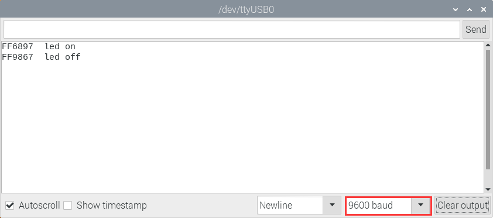

### Project 35：Bluetooth

This chapter mainly introduces how to use the bluetooth of ESP32 for
simple data transmission with mobile phone. Experiment 35.1 is
conventional bluetooth, and experiment 35.2 is bluetooth control LED.

#### Project 35.1：Classic Bluetooth

1.  **Components**

<table>
<tbody>
<tr class="odd">
<td></td>
<td>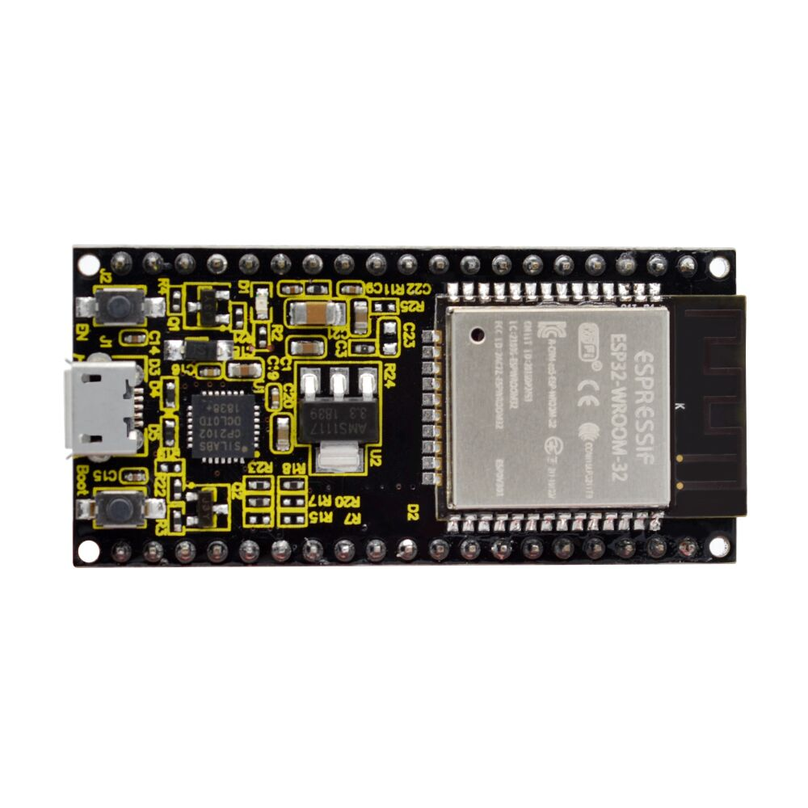</td>
</tr>
<tr class="even">
<td>Micro USB Cable*1</td>
<td>ESP32*1</td>
</tr>
</tbody>
</table>

In this project, we need to use a bluetooth dobbed serial bluetooth
terminal for a study. If you haven’t install it, please click the
installation: <https://www.appsapk.com/serial-bluetooth-terminal/> .

Here is its
[sign](C:/Users/NINGMEI/AppData/Local/youdao/dict/Application/8.10.7.0/resultui/html/index.html#/javascript:;)

2.  **Component Knowledge**

Bluetooth is a short-distance communication system that can be divided
into two types, namely low power bluetooth (BLE) and classic bluetooth.
There are two modes for simple data transfer: master mode and slave
mode. 

**Master Mode**: In this mode, work is done on the master device and can
be connected to the slave device. When the device initiates a connection
request in the main mode, information such as the address and pairing
password of other bluetooth devices are required.  Once paired, you can
connect directly to them.  

**Slave Mode**: A bluetooth module in the slave mode can only accept
connection requests from the host, but cannot initiate connection
requests. After being connected to a host device, it can send and
receive data through the host device. Bluetooth devices can interact
with each other, when they interact, the bluetooth device in the main
mode searches for nearby devices. While a connection is established,
they can exchange data. For example, when a mobile phone exchanges data
with ESP32, the mobile phone is usually in master mode and the ESP32 is
in slave mode.  

master mode slave mode

**3. Wiring Diagram**

We can use a USB cable to connect ESP32 mainboard to the USB port on the
Raspberry Pi.

**4. Test Code**

<table>
<tbody>
<tr class="odd">
<td>
//**********************************************************************************

/*

* Filename : Classic Bluetooth--SerialToSerialBT

* Description : ESP32 communicates with the phone by bluetooth and print phone's data via a serial port

* Auther : http//www.keyestudio.com

*/

#include "BluetoothSerial.h"

BluetoothSerial SerialBT;

String buffer;

void setup() 

void loop() 

if (SerialBT.available()) 

delay(20);

}

//**********************************************************************************
</td>
</tr>
</tbody>
</table>

**5. Test Result**

Compile and upload the code to the ESP32. After uploading
successfully，we will use a USB cable to power on. Open the serial
monitor and set the baud rate to 115200. We need to press the reset
button on the ESP32, when you see the serial prints the character, as
shown below, it means that the ESP32's bluetooth is waiting for
connection with a phone. (If open the serial monitor and set the baud
rate to 115200, the information is not displayed, please press the RESET
button of the ESP32)

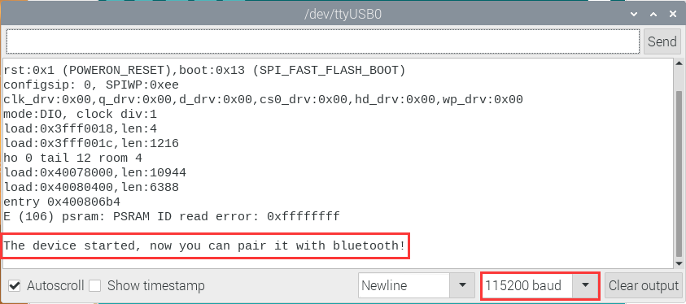

Ensure that your mobile phone bluetooth is enabled and the bluetooth
application of "Serial Bluetooth Terminal" is installed.  

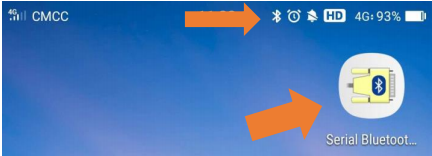

Click“Search”，search for the nearby bluetooth and select to connect
the“ESP32 test”.

Open the software APP and click the left side of the terminal, select
"Devices".

If you select ESP32test in classic bluetooth mode, a successful
connection message will appear as shown below.  

Data can be transferred between your phone and Raspberry Pi via ESP32
now.  

Send “Hello！”, When the Raspberry Pi receives it, which will reply with
"Hi\!".

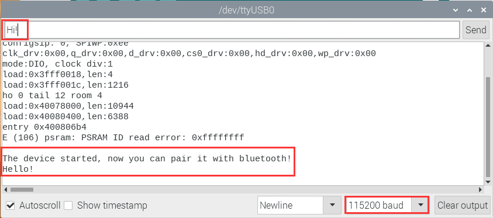

#### Project 35.2：Bluetooth Control LED

1.  **Components**

<table>
<tbody>
<tr class="odd">
<td></td>
<td></td>
<td></td>
</tr>
<tr class="even">
<td>ESP32*1</td>
<td>ESP32 Expansion Board*1</td>
<td></td>
</tr>
<tr class="odd">
<td></td>
<td></td>
<td></td>
</tr>
<tr class="even">
<td>Keyestudio Purple LED Module*1</td>
<td>3P Dupont*1</td>
<td>MicroUSB Cable*1</td>
</tr>
</tbody>
</table>

2.  **Wiring Diagram**
    
    

3.  **Test Code**

<table>
<tbody>
<tr class="odd">
<td>
//**********************************************************************************

/*

* Filename : Bluetooth Control LED

* Description : The phone controls esp32's led via bluetooth.

When the phone sends "LED_on," ESP32's LED lights turn on.

When the phone sends "LED_off," ESP32's LED lights turn off.

* Auther : http//www.keyestudio.com

*/

#include "BluetoothSerial.h"

#include "string.h"

#define LED 15

BluetoothSerial SerialBT;

char buffer[20];

static int count = 0;

void setup() 

void loop() 

if(count&gt;0)

if(strncmp(buffer,"led_off",7)==0)

count=0;

memset(buffer,0,20);

}

}

//**********************************************************************************
</td>
</tr>
</tbody>
</table>

**5. Test Result**

Connect the wires according to the experimental wiring diagram, compile
and upload the code to the ESP32. After uploading successfully，we will
use a USB cable to power on and press the reset button on the ESP32. The
APP operation is the same as the project 35.1. To make the external LED
on and off, simply change the sending content to "led\_on" and
"led\_off". Moving the APP to send data:

The serial monitor will display as follows:

**LED Circumstance**

**Note:** If the sent content is not "led-on 'or" led-off ", the status
of the LED will not change. If the LED is on, it remains on when
irrelevant content is received; Conversely, if the LED is off, it
continues to be off when irrelevant content is received.   

### Project 36：WIFI Station Mode

1.  **Description**

ESP32 has three different WiFi modes: Station mode, AP mode and
AP+Station mode. All WiFi programming projects must be configured with
WiFi running mode before using, otherwise the WiFi cannot be used. In
this project, we are going to learn the WiFi Station mode of the ESP32.

**2. Components**

<table>
<tbody>
<tr class="odd">
<td></td>
<td></td>
</tr>
<tr class="even">
<td>MicroUSB Cable*1</td>
<td>ESP32*1</td>
</tr>
</tbody>
</table>

**3. Wiring Diagram**

Plug the ESP32 to the USB port of your Raspberry Pi.

**4. Component Knowledge**

**Station mode：**

When setting Station mode, the ESP32 is taken as a WiFi client. It can
connect to the router network and communicate with other devices on the
router via a WiFi connection. As shown in the figure below, the PC and
the router have been connected. If the ESP32 wants to communicate with
the PC, the PC and the router need to be connected.

**5. Test Code**

Since WiFi names and passwords vary from place to place, thereby users
need to enter the correct WiFi names and passwords in the box shown
below before the program code runs.  

<table>
<tbody>
<tr class="odd">
<td>
//**********************************************************************************

/*

* Filename : WiFi Station

* Description : Connect to your router using ESP32

* Auther : http//www.keyestudio.com

*/

#include &lt;WiFi.h&gt; //Include the WiFi Library header file of ESP32.

//Enter correct router name and password.

const char *ssid_Router = "ChinaNet-2.4G-0DF0"; //Enter the router name

const char *password_Router = "ChinaNet@233"; //Enter the router password

void setup()

Serial.println("\nConnected, IP address: ");

Serial.println(WiFi.localIP());//Serial monitor prints out the IP address assigned to ESP32.

Serial.println("Setup End");

}

void loop() 

//**********************************************************************************
</td>
</tr>
</tbody>
</table>

**6. Test Result**

After entering the correct WiFi names and passwords, compile and upload
the code to the ESP32. After uploading successfully，we will use a USB
cable to power on. Open the serial monitor and set the baud rate to
115200. When the ESP32 successfully connects to ssid\_WiFi, the serial
monitor prints out the IP address, then monitor will display as follows:
(If open the serial monitor and set the baud rate to 115200, the
information is not displayed, please press the RESET button of the
ESP32)

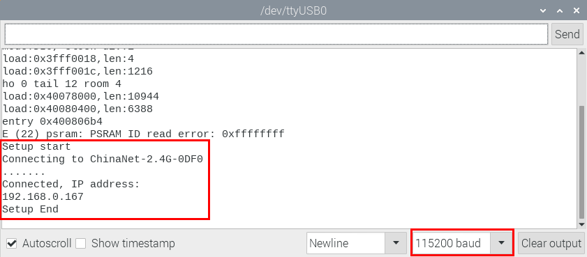

### Project 37：WIFI AP Mode

1.  **Description**

In this project, we are going to learn the WiFi AP mode of the ESP32.

**2. Components**

<table>
<tbody>
<tr class="odd">
<td></td>
<td></td>
</tr>
<tr class="even">
<td>MicroUSB Cable*1</td>
<td>ESP32*1</td>
</tr>
</tbody>
</table>

**3. Wiring Diagram**

Plug the ESP32 mainboard to the USB port of your Raspberry Pi

**4. Component Knowledge**

**AP Mode:**

When setting AP mode, a hotspot network will be created, waiting for
other WiFi devices to connect. As shown below;

Take the ESP32 as the hotspot, if a phone or PC needs to communicate
with the ESP32, it must be connected to the ESP32's hotspot.
Communication is only possible after a connection is established via the
ESP32.

**5. Test Code**

Before running the code , you can make any changes to the ESP32 AP name
and password in the box as shown below, but in a default circumstance,
it doesn’t need to modify.

<table>
<tbody>
<tr class="odd">
<td>
//**********************************************************************************

/*

* Filename : WiFi AP

* Description : Set ESP32 to open an access point

* Auther : http//www.keyestudio.com

*/

#include &lt;WiFi.h&gt; //Include the WiFi Library header file of ESP32.

const char *ssid_AP = "ESP32_WiFi"; //Enter the router name

const char *password_AP = "12345678"; //Enter the router password

IPAddress local_IP(192,168,1,108);//Set the IP address of ESP32 itself

IPAddress gateway(192,168,1,1); //Set the gateway of ESP32 itself

IPAddress subnet(255,255,255,0); //Set the subnet mask for ESP32 itself

void setup()else

Serial.println("Setup End");

}

void loop() 

//**********************************************************************************
</td>
</tr>
</tbody>
</table>

**6. Test Result**

Compile and upload the code to the ESP32. After uploading
successfully，we will use a USB cable to power on. Open the serial
monitor and set the baud rate to 115200, then monitor will display as
follows: (If open the serial monitor and set the baud rate to 115200,
the information is not displayed, please press the RESET button of the
ESP32)

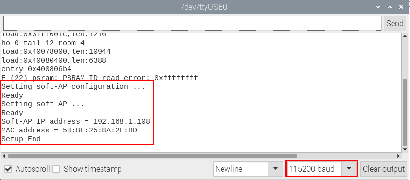

When observing the printed information of the serial monitor, turn on
the WiFi scanning function of the mobile phone, you can see the ssid\_AP
on ESP32, which is dubbed "ESP32\_Wifi" in this code. You can connect to
it either by typing the password "12345678" or by modifying the code to
change its AP name and password.  

### Project 38：WIFI AP+Station Mode

1.  **Description**

In this project, we are going to learn the AP+Station mode of the ESP32.

**2. Components**

<table>
<tbody>
<tr class="odd">
<td></td>
<td></td>
</tr>
<tr class="even">
<td>MicroUSB Cable*1</td>
<td>ESP32*1</td>
</tr>
</tbody>
</table>

**3. Wiring Diagram**

Plug the ESP32 mainboard to the USB port of your Raspberry Pi

**4. Component Knowledge**

**AP+Station mode:**

In addition to the AP mode and the Station mode, **AP+Station mode** can
be used at the same time. Turn on the Station mode of the ESP32, connect
it to the router network, and it can communicate with the Internet
through the router. Then turn on the AP mode to create a hotspot
network. Other WiFi devices can be connected to the router network or
the hotspot network to communicate with the ESP32.

**5. Test Code**

Before running the code, you need to modify the
ssid\_Router、password\_Router、ssid\_AP and password\_AP.

<table>
<tbody>
<tr class="odd">
<td>
//**********************************************************************************

/*

* Filename : WiFi AP+Station

* Description : ESP32 connects to the user's router, turning on an access point

* Auther : http//www.keyestudio.com

*/

#include &lt;WiFi.h&gt;

const char *ssid_Router = "ChinaNet-2.4G-0DF0"; //Enter the router name

const char *password_Router = "ChinaNet@233"; //Enter the router password

const char *ssid_AP = "ESP32_WiFi"; //Enter the router name

const char *password_AP = "12345678"; //Enter the router password

void setup()else

Serial.println("\nSetting Station configuration ... ");

WiFi.begin(ssid_Router, password_Router);

Serial.println(String("Connecting to ")+ ssid_Router);

while (WiFi.status() != WL_CONNECTED)

Serial.println("\nConnected, IP address: ");

Serial.println(WiFi.localIP());

Serial.println("Setup End");

}

void loop() 

//**********************************************************************************
</td>
</tr>
</tbody>
</table>

**6. Test Result**

Ensure that the code in the program has been modified correctly, compile
and upload the code to the ESP32. After uploading successfully，we will
use a USB cable to power on. Open the serial monitor and set the baud
rate to 115200, then monitor will display as follows: (If open the
serial monitor and set the baud rate to 115200, the information is not
displayed, please press the RESET button of the ESP32)

Open the WiFi scanning function of the mobile phone, you can see the
ssid\_AP.

### Project 39: Comprehensive Experiment

1.  **Introduction**

We did a lot of experiments, and for each one we needed to re-upload the
code, so can we achieve different functions through an experiment? In
this experiment, we will use an external button module to achieve
different functions

**2. Components Required**

<table>
<tbody>
<tr class="odd">
<td></td>
<td></td>
<td></td>
<td></td>
<td></td>
</tr>
<tr class="even">
<td>ESP32 Board*1</td>
<td>ESP32 Expansion Board*11</td>
<td>Keyestudio DIY Purple LED Module*1</td>
<td>Keyestudio Button Module*1</td>
<td>Keyestudio Rotary Potentiometer*1</td>
</tr>
<tr class="odd">
<td></td>
<td></td>
<td></td>
<td></td>
<td></td>
</tr>
<tr class="even">
<td>Keyestudio Obstacle Avoidance Sensor*1</td>
<td>Keyestudio DIY Joystick Module*1</td>
<td>Keyestudio HC-SR04 Ultrasonic sensor *1</td>
<td>Keyestudio DIY Common Cathode RGB Module *1</td>
<td>MicroUSB Cable*1</td>
</tr>
<tr class="odd">
<td></td>
<td></td>
<td></td>
<td></td>
<td></td>
</tr>
<tr class="even">
<td>3PDupont Wire*4</td>
<td>4PDupont Wire*1</td>
<td>5PDupont Wire*1</td>
<td></td>
<td></td>
</tr>
</tbody>
</table>

**3. Wiring Diagram**

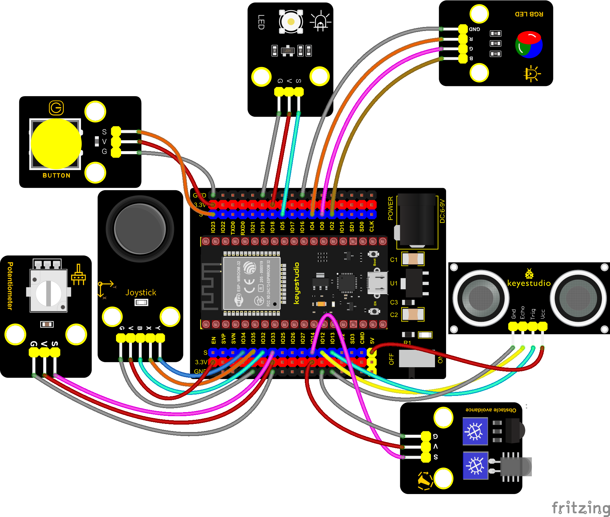

**4. Test Code**

<table>
<tbody>
<tr class="odd">
<td>
//**********************************************************************

/*

* Filename : Comprehensive experiment

* Description : Multiple sensors/modules work together

* Auther : http//www.keyestudio.com

*/

//rgb is connected to 4,0,2

int ledPins[] = ; //define red, green, blue led pins

const byte chns[] = ; //define the pwm channels

int red, green, blue;

//Rocker module port

int X = 35;

int Y = 34;

int KEY = 32;

//Potentiometer pin is connected to analog port 33

int resPin = 33;

//Obstacle avoidance sensor pin connected to IO port 14

int Avoid = 14;

//LED is Connected to GP5

#define PIN_LED 5 // the pin of the LED

#define CHAN 3

//Ultrasonic sensor port

int Trig = 13;

int Echo = 12;

//Key module port

int button = 23;

int PushCounter = 0;//Store the number of times a key is pressed

int yushu = 0;

unsigned char dht[4] = ;//Only the first 32 bits of data are received, not the parity bits

bool ir_flag = 1;

float out_X, out_Y, out_Z;

void counter() 

}

void setup() 

}

void loop()  else if (yushu == 1)  else if (yushu == 2) else if (yushu == 3)  else if (yushu == 4) 

}

//RGB

void yushu_0() 

void setColor(byte r, byte g, byte b) 

void yushu_1() 

else 

delay(100);

}

void yushu_2() 

void yushu_3() 

void yushu_4() 

float checkdistance() 

//*************************************************************************************
</td>
</tr>
</tbody>
</table>

**5. Code Explanation**

1\. Calculate how many times the button is pressed, divide it by 5, and
get the remainder which is 0, 1 2, 3, and 4. According to different
remainders, construct five unique functions to control the experiment
and realize different functions.

2\. Following the instructions, we can add or remove sensors/modules in
the wiring, and then change the experimental function in the code.

**6. Test Result**

Connect the wires according to the experimental wiring diagram, compile
and upload the code to the ESP32. After uploading successfully，we will
use a USB cable to power on. At the beginning, the number of the button
is 0 and remainder is 0. Open the monitor and set baud rate to 9600.

Press the button, the RGB stops flashing, press once, the remainder is
1.

The function of the project is whether the obstacle avoidance sensor
detects obstacles and reads high and low levels. If the sensor does not
detect an obstacle, val is 1 and the serial monitor displays "1 All
going well" character. When an obstacle is detected, val is 0, and the
serial monitor displays "0 There are obstacles" character. The monitor
will display as follows:

Note: If you press the button first, the button times will change to 1,
and when you open the serial monitor, the program will reset and the
button times will change to 0. You need to press the button again to
reset the button times.  

Press the button again, the time of pressing buttons is 2 and the
remainder is 2. Read digital values at x, y and z axis of the joystick
module. As shown below;

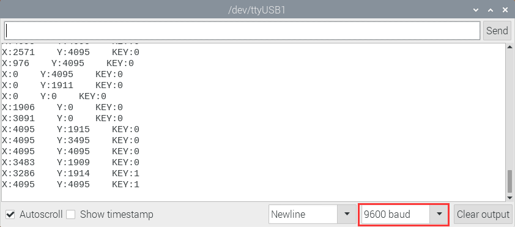

Press the key for the third time, the remainder is 3. Then the
potentiometer can adjust the PWM value at the GPI05 port to control LED
brightness of the purple LED.

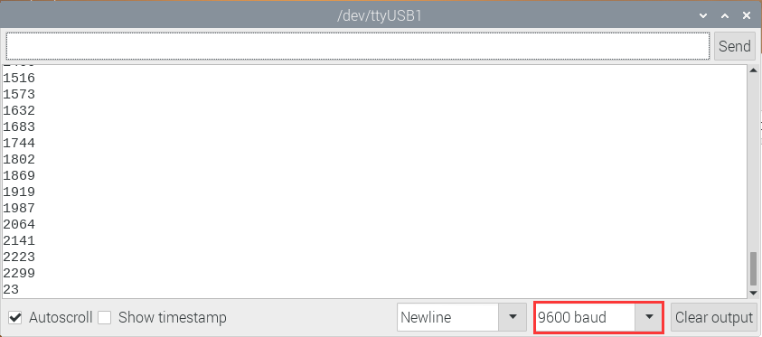

Press the key for the fourth time, the remainder is 4. Then the
ultrasonic sensor can detect distance, as shown below;

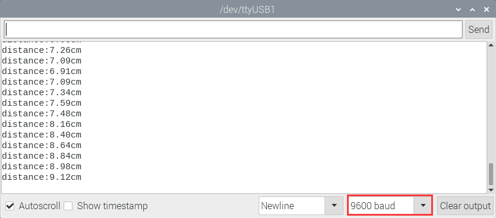

Press the key for the fifth time, the remainder is 0. Then the RGB will
flash. If you press keys incessantly, remainders will change in a loop
way. So does functions.

## 6. Resources

Download code, libraries and more details, please refer to the following
link:

https://fs.keyestudio.com/KS5007-5008
