# Preparation before class for C(Raspberry Pi)

Raspberry Pi is a card computer whose official system is Raspberry Pi
OS, and can be installed on the Raspberry Pi, such as: ubuntu, Windows
IoT. Raspberry Pi can be used as a personal server, performing camera
monitoring and recognition, as well as voice interaction by connecting a
camera and a voice interactive assistant. Also, Raspberry Pi leads out
40Pin pins that can be connected to various sensors and control LEDs,
motors, etc. These can be used to make a robot with a Raspberry Pi.

## 1. Tools needed for the Raspberry Pi system

**Hardware Tool:**

  - Raspberry Pi 4B/3B/2B

  - Above 16G TFT Memory Card

  - Card Reader

  - Computer and other parts

**1.1 Install Software Tools**

**Windows System:**

1)  **Putty**
    
    Download
    link：[https://www.chiark.greenend.org.uk/\~sgtatham/putty/](https://www.chiark.greenend.org.uk/~sgtatham/putty/)
    
    
    
    

<!-- end list -->

1.  After downloading the package file ,
    double-click it and tap “Next”.
    
    

2.  Click “Next”.
    
    

3.  Choose“Install Putty files” and click “Install”.
    
    

4.  After a few seconds, click "Finish".
    
    
    
    **(2) SSH Remote Login software -WinSCP**
    
    Link：[https://winscp.net/eng/download.php](https://winscp.net/eng/download.php)

<!-- end list -->

1.  After downloading the package file, click
    .
    
    

2.  Click“Accept”.

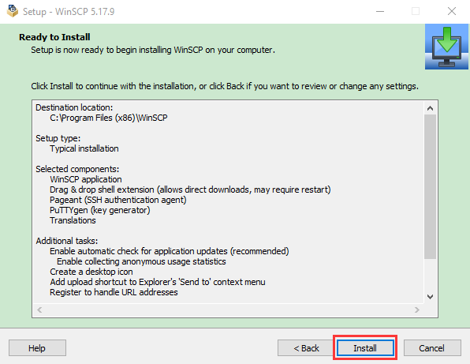

**(3）SD Card Formatter**

Download link:

[http://www.canadiancontent.net/tech/download/SD\_Card\_Formatter.html](http://www.canadiancontent.net/tech/download/SD_Card_Formatter.html)

1.  Unzip the SDCardFormatterv5\_WinEN package, double-click
     to run it.
    
    
    
    
    
    

2.  Click“Next”and“Install”.
    
    
    
    

3.  After a few seconds, click "Finish".
    
    
    
    **(4) Win32DiskImager**
    
    Download：[https://sourceforge.net/projects/win32diskimager/](https://sourceforge.net/projects/win32diskimager/)
    
    
    
    a. After downloading the package file ,
    double-click to run it.
    
    
    
    b. Choose and click“Next”.

c. Click“Browse...”and tap“Next”.

d. Choose , click“Next”and“Install”.

e. After a few seconds, click "Finish".

(5) WNetWatcher for scanning and searching IP addresses  

Download Link：http://www.nirsoft.net/utils/wnetwatcher.zip

**1.2 Raspberry Pi Imager**

Download link for the latest version:

[https://www.raspberrypi.org/downloads/raspberry-pi-os/](https://www.raspberrypi.org/downloads/raspberry-pi-os/)

Old Version:

Raspbian：https://downloads.raspberrypi.org/raspbian/images/

Raspbian
full：https://downloads.raspberrypi.org/raspbian\_full/images/

Raspbian lite：https://downloads.raspberrypi.org/raspbian\_lite/images/

We use the 2020.05.28 version in the tutorial and recommend you to use
this version

(Please download this version as shown in the picture below.)

<https://downloads.raspberrypi.org/raspios_full_armhf/images/raspios_full_armhf-2021-05-28/>

## 2. Install Raspberry Pi OS on Raspberry Pi 4B

Interface the TFT memory card with a card reader, then plug the card
reader into a computer’s USB port.

Use the SD Card Formatter to format a TFT memory card, as illustrated
below.

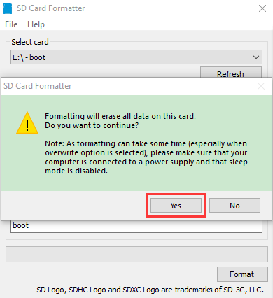

1)  **Burn system**
    
    Burn the Raspberry Pi OS to the TFT memory card using
    Win32DiskImager software.

Don’t eject card reader after burning mirror system, build a file named
SSH, then delete .txt.

The SSH login function can be activated by copying SSH file to boot
category, as shown below.

Eject card reader.

2)  **Log in system**
    
    (Raspberry and PC should be in the same local area network.)
    
    Insert TFT memory card into Raspberry Pi, connect internet cable and
    plug in power. If you have screen and HDMI cable of Raspberry Pi,
    you could view Raspberry Pi OS activating. If not, you can enter the
    desktop of Raspberry Pi via SSH remote login software---WinSCP and
    xrdp.
    
    **(3) Remote login**
    
    **Enter default user name, password and host name on WinSCP to log
    in. Only a Raspberry Pi is connected in the same network.**
    
    
    
    
    
    **(4) Check IP and mac address**
    
    
    
    Click to open terminal and input the password: raspberry, and
    press“Enter”on keyboard.
    
    
    
    
    
    Logging in successfully, open the terminal, input **ip a** and
    tap“Enter”to check IP and mac address.
    
    
    
    From the above figure, mac address of this Raspberry Pi is
    a6:32:17:61:9c, and IP address is 192.168.1.128(use IP address to
    finish xrdp remote login).
    
    Since mac address never changes, you could confirm IP via mac
    address when not sure which IP it is.
    
    **(5) Fix IP address of Raspberry Pi**
    
    IP address is changeable, therefore, we need to make IP address
    fixed for convenient use.
    
    Follow the below steps:
    
    Switch to root user
    
    If without root user’s password
    
    ① Set root password

Input password in the terminal: sudo passwd root to set password.

② Switch to root user

su root

③ Fix the configuration file of IP address

Firstly change IP address of the following configuration file.

（\#New IP address:：address 192.168.1.99）

Copy the above new address to terminal and press“Enter”.

Configuration File**:**

echo -e '

auto eth0

iface eth0 inet static

\#Change IP address

address 192.168.1.99

netmask 255.255.255.0

gateway 192.168.1.1

network 192.168.1.0

broadcast 192.168.1.255

dns-domain 119.29.29.29

dns-nameservers 119.29.29.29

metric 0

mtu 1492

'\>/etc/network/interfaces.d/eth0

As shown below:

④ Reboot the system to activate the configuration file.

Input the restart command in the terminal: sudo reboot

You could log in via fixed IP afterwards.

⑤ Check IP and insure IP address fixed well.

(6) Log in desktop on Raspberry Pi wirelessly

In fact, we can log in desktop on Raspberry Pi wirelessly even without
screen and HDMI cable.

VNC and Xrdp are commonly used to log in desktop of Raspberry Pi
wirelessly. Let’s take an example of Xrdp.

Install Xrdp Service in the terminal

Installation commands:

Switch to Root User: su root

Installation: apt-get install xrdp

Enter y and press“Enter”.

As shown below:

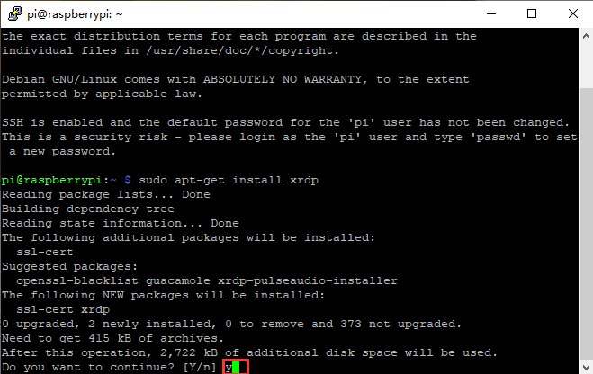

Open the remote desktop connection on Windows

Press WIN+R on keyboard and enter mstsc.exe.

As shown below:

Input IP address of Raspberry Pi, as shown below.

Click“Connect”and tap it again.

192.168.1.99 is the IP address we use, you could change into your IP
address.

Click“Yes”.

Input user name: pi, default password: raspberry, as shown below.

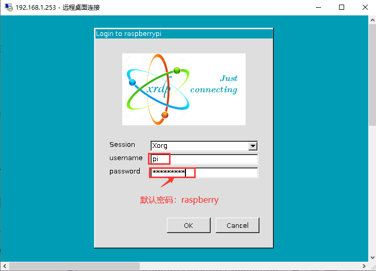

Click“OK”or“Enter”, you will view the desktop of Raspberry Pi OS, as
shown below.

Now, we finish the basic configuration of the Raspberry Pi OS.

## 3. Preparations for C language

[C](C:/Users/NINGMEI/AppData/Local/youdao/dict/Application/8.10.7.0/resultui/html/index.html#/javascript:;) [language](C:/Users/NINGMEI/AppData/Local/youdao/dict/Application/8.10.7.0/resultui/html/index.html#/javascript:;)
is a programming language with a considerably fast running speed. There
are numerous software and system core code written in it, such as Linux
system. Notably, hardware MCU and embedded class are not exception.
Thereby, it makes sense to learn the
[C](C:/Users/NINGMEI/AppData/Local/youdao/dict/Application/8.10.7.0/resultui/html/index.html#/javascript:;) [language](C:/Users/NINGMEI/AppData/Local/youdao/dict/Application/8.10.7.0/resultui/html/index.html#/javascript:;)
to control hardware.

1)  **Hardware：**
    
    **Raspberry Pi 4B：**

<table>
<tbody>
<tr class="odd">
<td><strong>Raspberry Pi 4B</strong></td>
<td><strong>Raspberry Pi 4B Model</strong></td>
</tr>
<tr class="even">
<td></td>
<td></td>
</tr>
</tbody>
</table>

**Hardware Interfaces：**

## 4. ESP32 Expansion Board：
    
    
    
    Raspberry Pi+ESP32 mainboard+ESP32 Expansion Board+USB Cable are as
    follows：

2)  **Copy Example Code Folder to Raspberry Pi**

Place example code folder to the pi folder of Raspberry Pi. and extract
the example code from **2. ESP32\_C\_code.zip** file(the default is ZIP
file), as shown below:

Double-click **2.ESP32\_C\_code,**  as shown below.  

## Linux System（Raspberry Pi） 

**5.1 Download and install Arduino IDE**

（1）First, click on Raspberry Pi's browser.

（2）Download Arduino IDE from the Arduino official
website：[www.arduino.cc/en/software](http://www.arduino.cc/en/software),as
shown below:

(3) There are various versions of IDE for Arduino. Just download a
version compatible with your system. (install the lasted Arduino IDE)
and click “Linux ARM 32 bits”.

You just need to click JUST DOWNLOAD.

After a few seconds, the lasted Arduino IDE（Arduino 1.8.19 version）zip
file can be directly downloaded

(4) Click , then find the Downloads file from the
pi and tap it. Then we can see the downloaded
package“arduino-1.8.19-linuxarm.tar.xz”and unzip it.

（5）Click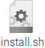file
and tap it，click“Execute” to install the Arduino IDE.

（6）Click and click
 to open the Arduino IDE.

**5.2 Install the ESP32 on Arduino IDE**

Note：you need to download Arduino IDE 1.8.5 or advanced version to
install the ESP32.

1.  > Click and
    > click  to open the Arduino IDE.
    
    
    
    (2） Click **“ File**” →**“Preferences”**，copy the website address
    <https://dl.espressif.com/dl/package_esp32_index.json> in
    the“**Additional Boards Manager URLs:**”and click“**OK**”
    
    

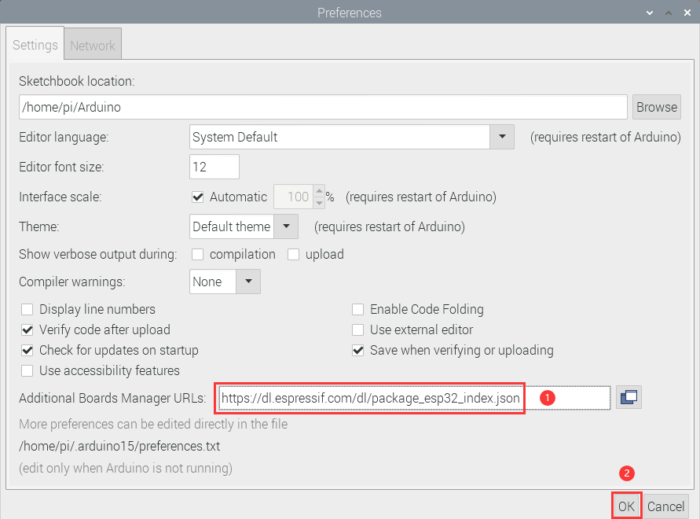

（3） Click“**Tools**”→“**Board:**”then click “**Boards Manager...**”to
enter“**Boards Manager**”. Enter “esp**32**”as follows, then click
**Install .**

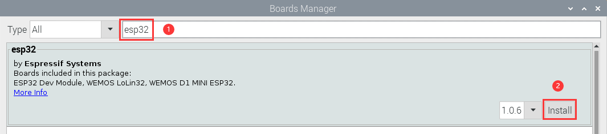

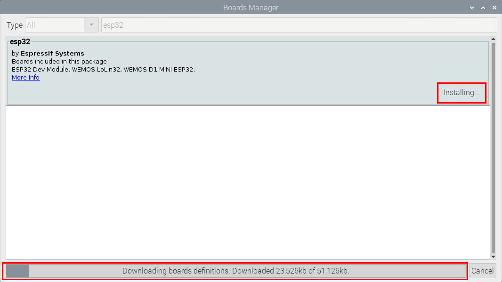

(4) After installing, click“Close”

**5.3. Arduino IDE Setting**

Click and click
 to open the Arduino IDE.

When downloading the sketch to the board, you must select the correct
name of Arduino board that matches the board connected to your computer.
As shown below;

(Note: we use the ESP32 board in this tutorial; therefore, we select
ESP32**)**

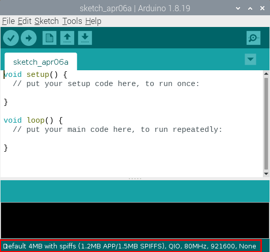

Then select the correct COM port (you can see the corresponding COM port
after the ESP32 is connected to the Raspberry Pi via a USB cable.).

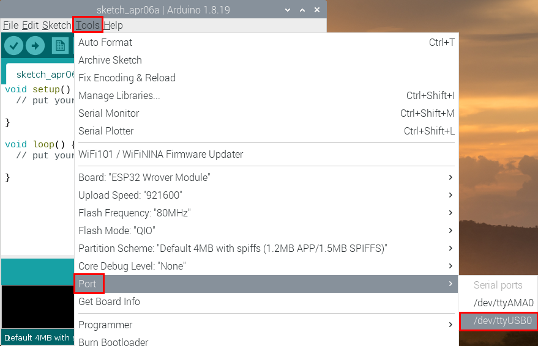

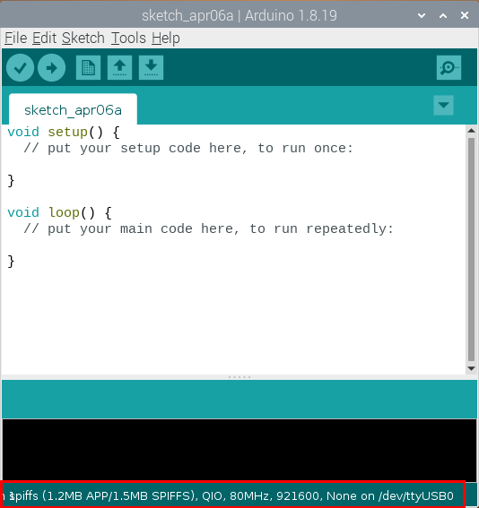

A- Used to verify whether there is any compiling mistakes or not.

B- Used to upload the sketch to your Arduino board.

C- Used to create shortcut window of a new sketch.

D- Used to directly open an example sketch.

E- Used to save the sketch.

F- Used to send the serial data received from board to the serial
monitor.

**6. How to Add Libraries?**

**(1) What are Libraries ?**

[Libraries ](https://www.arduino.cc/en/Reference/Libraries)are a
collection of code that make it easy for you to connect sensors,
displays, modules, etc.

For example, the built-in LiquidCrystal library helps talk to LCD
displays. There are hundreds of additional libraries available on the
Internet for download.

The built-in libraries and some of these additional libraries are listed
in the reference. (https://www.arduino.cc/en/Reference/Libraries)

**(2) How to Install a Library ?**

Here we will introduce the most simple way to add libraries .

**Step 1:** Click ，tap“Downloads”file
，and
click“arduino-1.8.19”file，then find and
click“libraries” file 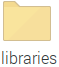from the
“arduino-1.8.19”file.

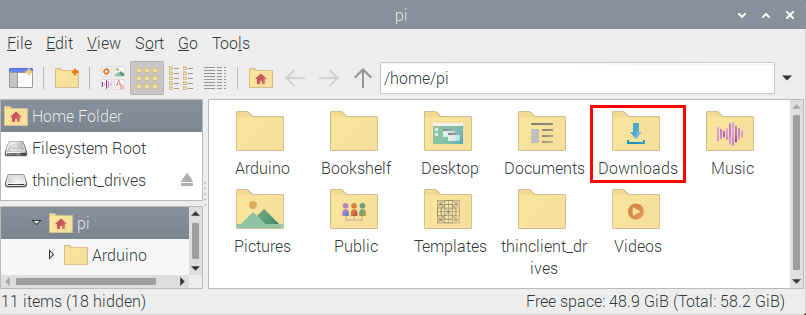

**Step 2:** Copy and paste the Arduino C library ZIP file (default ZIP
file) from the provided Arduino Libraries folder into the Libraries file
opened in the first step（the route
is：/home/pi/Downloads/arduino-1.8.19/libraries）.

**Step 3:** Unzip the Arduino C package in the libraries folder（for
example：click “Adafruit\_NeoPixel.zip”file
，select and tap“Extract Here”to unzip the
“Adafruit\_NeoPixel.zip”file.

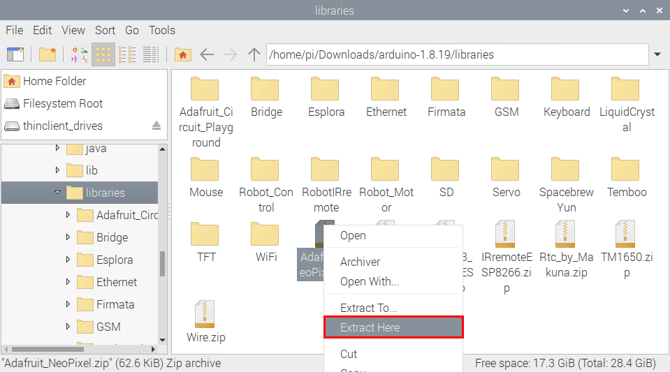

